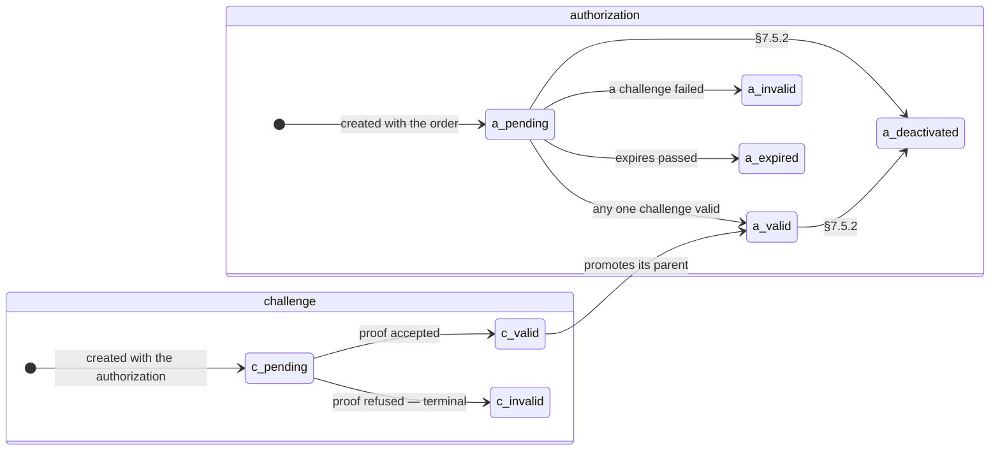
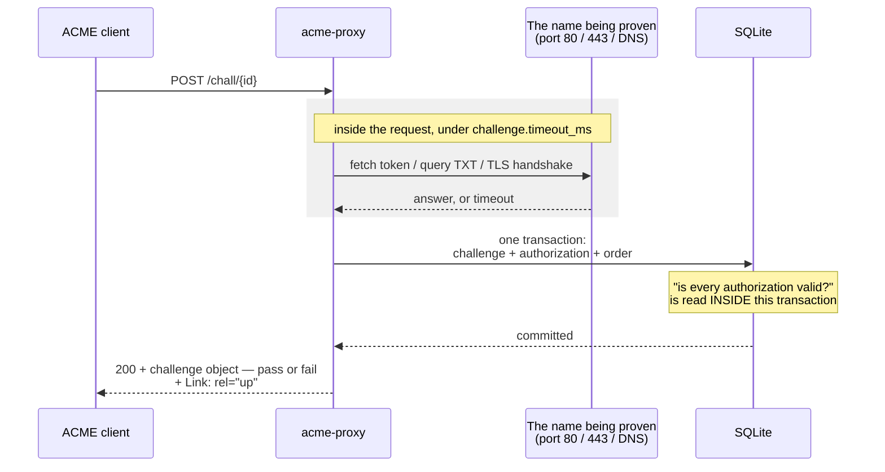

# Challenge Validation

A **challenge** is how a client proves to `acme-proxy` that it controls the
identifiers it is asking for. Every authorization created by `newOrder` carries
one challenge per enabled type; satisfying **any one** of them makes the
authorization `valid`, and an order becomes `ready` once every authorization is.

`acme-proxy` implements all three challenge types RFC 8555 and RFC 8737 define:

- **[`http-01`](http_01.md)** — serve a token over HTTP.
- **[`dns-01`](dns_01.md)** — publish a TXT record.
- **[`tls-alpn-01`](tls_alpn_01.md)** — present a special certificate in a TLS
  handshake.

This is validation `acme-proxy` performs against **its own clients**. It is
separate from how the [`relay` signer backend](../signers/relay.md)
satisfies an *upstream* CA's challenges on your behalf; the two are configured
independently and need not match.

## Configuration

```toml
[challenge]
# Types offered, in this order. Empty or unknown = startup error.
enabled = ["http-01", "dns-01"]

# Skip validation entirely. Testing only.
bypass = false

# Budget for one validation attempt.
timeout_ms = 5000
```

`[challenge]` is a **per-profile** section: each endpoint can offer a different
set of types. See [Profiles & Routing](../core/profiles.md).

### Reference

**`enabled`** (`Array`) — *Default: `["http-01"]` | Env: `ACME_PROXY_CHALLENGE__ENABLED`*

Which types each new authorization offers, and in what order. Clients pick one.
Valid values are `http-01`, `dns-01` and `tls-alpn-01`. An empty list, or an
unrecognised name, is a **startup error — even when `bypass` is on**, because a
bypassing server still has to advertise a challenge for the client to trigger.

**`bypass`** (`Boolean`) — *Default: `false` | Env: `ACME_PROXY_CHALLENGE__BYPASS`*

Mark a triggered challenge `valid` immediately, with no network check. With this
on, `[filter]` is the **only** access control there is — which is why it is not
the default.

**`timeout_ms`** (`Integer`) — *Default: `5000` | Env: `ACME_PROXY_CHALLENGE__TIMEOUT_MS`*

Budget for one validation attempt, applied at the registry level whatever the
type. Validation runs *inside* `POST /chall/{id}`, so this is also that
request's worst case, and it must stay below `server.request_timeout_ms` —
`Profile::build_all` refuses to start otherwise.

Per-type keys live under `[challenge.http_01]` and `[challenge.tls_alpn_01]`;
see those pages. `dns-01` has no table of its own — it is governed by
`dns.resolver`.

## Bypass is not a shortcut

> With `challenge.bypass = true`, **`[filter]` is the only access control the
> server has**. Anyone who can reach the endpoint can obtain a certificate for
> any name it will accept, without proving anything.

Bypass exists for two legitimate cases: local testing (as in the [Quick
Start](../getting_started/quick_start.md)), and a deployment where an
IPAM-backed filter such as [`ipam`](../ipam/index.md) is genuinely the
authority on which host may hold which name, making a network round-trip
redundant.

It defaulted to `true` early in this project's life. That was reconsidered: an
empty `filter.enabled` plus the default bind on every interface made the
combination an open CA, so the default is now `false`.

## The two state machines

An authorization and its challenges are separate objects with separate statuses,
and the edge between them is the one worth internalising: **an authorization
becomes `valid` as soon as *any one* of its challenges does.** The siblings stay
`pending` for ever and that is correct.



`a_invalid` and `c_invalid` are terminal: the client must create a new order,
and re-triggering the same challenge will not retry it. Deactivation is the
operator- or client-initiated exit — see [Deactivation](#deactivation) below.

## Validation is inline and synchronous

Triggering a challenge with `POST /chall/{id}` performs the check **inside that
request**. There is no background worker and no polling loop.



The grey band is the part that surprises people: the client's HTTP request is
blocked on a connection to a third party for its whole duration.

Two consequences:

- `challenge.timeout_ms` is also the worst case for that HTTP request. It must
  stay below `server.request_timeout_ms`, and the server refuses to start if it
  does not.
- The server needs egress to the client. For `http-01` and `tls-alpn-01` it must
  be able to open a connection *back* to the machine requesting the certificate
  — a common source of "the order just sits at `pending`" in firewalled
  networks.

## Both outcomes are `200`

A validation failure returns **`200 OK` with the challenge object**, its status
set to `invalid` and an `error` member describing what went wrong. It is not a
4xx.

This follows RFC 8555 §7.5.1, and it is load-bearing: certbot's `acme` library
surfaces an HTTP error status as a *transport* failure, which would obscure the
actual reason the challenge failed. Read the challenge object's `status`, not
the HTTP status.

Responses also carry a `Link: rel="up"` header pointing at the authorization,
which that same library requires.

A challenge that reaches `invalid` is **terminal**. The client must create a new
order; re-triggering the same challenge will not retry it.

## Wildcards

A wildcard identifier such as `*.example.com` is accepted **only when `dns-01`
is among `enabled`** — it is the only challenge type that can prove control of a
whole subtree. Otherwise `newOrder` refuses with `rejectedIdentifier`, naming
`dns-01`.

For a wildcard identifier:

- The authorization is created on the **base** name (`example.com`), with
  `"wildcard": true` in the authorization object.
- It offers **`dns-01` alone**, even if other types are enabled.

Ordering `example.com` and `*.example.com` together therefore produces two
authorizations on the same base name, and the TXT record for each goes to the
same `_acme-challenge.example.com`. `acme-proxy` matches *any* TXT record at
that name, so publishing both values side by side works.

Only a single leading `*.` is legal. `*.*.example.com` and `foo.*.example.com`
are rejected as malformed.

## What happens on success

Success is committed as one transaction covering the challenge, its
authorization, and the order — including the "is every authorization now valid?"
read that promotes the order to `ready`. Doing that read inside the transaction
is deliberate: two concurrent validations of one order could otherwise each read
before the other's write landed, and neither would promote the order.

Note the promotion depends on every **authorization** being valid, not every
challenge. An authorization with three challenges needs only one of them.

## Deactivation

A client can deactivate an authorization it no longer wants by POSTing
`{"status": "deactivated"}` to the authorization URL (§7.5.2). If the order had
already reached `ready`, it is demoted back to `pending`.

Deactivation is refused once the order is `valid` — at that point the
certificate exists, and [revocation](../operations/revocation.md), not
deactivation, is what undoes it.
