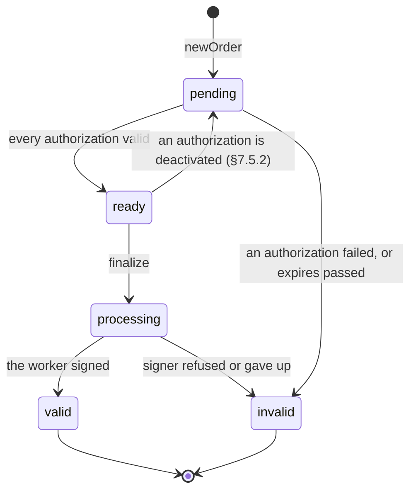

# Core Concepts & Glossary

Eight words carry most of the meaning in the rest of this book. This page
defines them once, in the order you meet them, so that every other page can use
them without re-explaining.

## Profile

A **profile** is an independent ACME endpoint, and the isolation boundary
everything else sits inside. Rather than running one process per environment,
you define several profiles in one; each is served at
`/profile/<name>/directory`.

Accounts and orders are isolated per profile — the same client key at two
profiles is two unrelated accounts — and each profile carries its own signer,
filters, challenge validation and EAB policy. A `dev` profile backed by a local
CA can sit beside a `prod` profile relaying to Let's Encrypt under strict NetBox
filtering, in one process, over one socket and one database.

See [Profiles & Routing](profiles.md).

## Signer

A **signer** is what actually produces the certificate once a client has been
authorized. Which one runs is a per-profile configuration choice, and the client
never sees the difference.

- **Local CA** — an embedded certificate authority signing directly. The issuing
  key is a file, or a PKCS#11 token.
- **Relay** — opens its own order with an upstream ACME CA and returns what
  that CA signs.
- **Custom script** — anything else: a legacy PKI, an internal API, a CA that
  does not speak ACME.

See [Signers](../signers/index.md).

## Filter

A **filter** is a policy applied to a request before anything is signed. Filters
answer "may this client ask for this?", which challenge validation does not: a
client can genuinely control a name and still have no business holding a
certificate for it from you.

`[filter]` is a small policy engine rather than a list of switches. A **check**
is one named question about a request — "is this address in the management
network?" — and a **rule** is a boolean expression over check names plus what a
match means. `filter.rules` says which rules run and in what order, and the
**first match wins**; a stage where a rule was applicable and none matched falls
to `filter.default`.

Rules act at two points — on the connection, and on the identifiers, the latter
running again at `finalize` against the names in the CSR.

See [Filters](../filters/index.md).

## EAB (External Account Binding)

**External Account Binding** (RFC 8555 §7.3.4) makes `newAccount` require a
credential you minted out of band — a key identifier and an HMAC secret.
Reaching the directory is then no longer enough to register: an operator has to
have issued that client a credential first.

It runs in the other direction too. A commercial CA that granted you one scarce
EAB credential is exactly the case the relay backend exists for: one upstream
credential, any number of local ones.

See [External Account Binding](../features/eab.md).

## ARI (ACME Renewal Information)

**ACME Renewal Information** (RFC 9773) lets the CA tell a client *when* to
renew, rather than leaving it to guess from the expiry date. Two things follow:
a fleet spreads its renewals across a window instead of stampeding at the same
moment, and a CA that needs certificates replaced early can say so and be
listened to.

See [Renewal Information](../features/renewal_info.md).

## Order
An **order** is a client's request for a certificate. It names the identifiers
wanted and progresses through the states RFC 8555 defines:

- `pending` — created; one or more authorizations still need to be satisfied.
- `ready` — every authorization is `valid`; the client may now `finalize`.
- `processing` — issuance is under way but not finished.
- `valid` — the certificate is available.
- `invalid` — terminal failure.

`acme-proxy` enforces these states and transitions in the database itself. A
`CHECK` constraint on the status column holds the set of states (see
[Database Schema](../dev/database.md#check-constraints-hold-the-state-machines)),
and every transition is an `UPDATE` guarded on the state it leaves. A
validation or signing that finishes after the order moved on, because the
client deactivated an authorization or a sibling challenge already decided
it, therefore changes nothing above its own challenge.

`ready → pending` is the one backwards edge, and it exists only so §7.5.2 can
hold: deactivating an authorization on an order that already reached `ready` has
to demote it, or the order would be finalizable for a name no longer authorized.

Two details are easy to trip on:

- **Every `finalize` answers `processing`.** Signing needs the CA key, which
  only the `worker` role holds, so `finalize` checks the CSR, claims the order
  and queues the signing, and the client polls until the order is `valid`. With
  `local_ca` that is a moment; with `relay` it is as long as the upstream CA
  takes. A CSR the backend itself rejects makes the order `invalid` with a
  `badCSR` error, since the client is already polling by then; a CSR `finalize`
  can refuse on its own leaves the order `ready` for a corrected one.
- **Revocation is orthogonal to this machine.** RFC 8555 defines no "revoked"
  order status, so a revoked order's `status` stays `valid`. The revocation
  timestamp and reason are recorded separately, and both admin front ends show
  them and can revoke — `acme-proxy order show`/`order revoke`, and the order
  detail page in the panel. See [Revocation & CRL](../operations/revocation.md).

## Job

A **job** is one unit of work the server owes itself: a relayed issuance to
finish, a notification to deliver, a table to sweep. Jobs are rows in the same
SQLite file as everything else, drained by one runner per process, so they
survive a restart and need no scheduler beside the server.

What is worth carrying away is how a handler reports failure. `Retry` says the
attempt decided nothing — a refused connection, a proxy, a `503` — and the job
goes back in the queue under a growing backoff; `Failed` says the other side
stated a reason and is believed at once. That split is what keeps a client's
order `processing` through a five-second upstream blip rather than terminally
`invalid`, and it is why an order that is not progressing is a question for
`acme-proxy jobs list` before it is a question for anything else.

See [Admin CLI → Job queue](../operations/cli.md#job-queue).

## Challenge

A **challenge** is the concrete proof that a client controls an identifier:
serving a token over HTTP, publishing a DNS TXT record, or presenting a special
certificate in a TLS handshake.

Each authorization carries one challenge per enabled type, and satisfying **any
one** of them makes the authorization `valid` — the others stay `pending` for
ever, which is correct rather than a stuck state.

Triggering one queues the check rather than performing it, so a triggered
challenge answers `processing` and the client polls it.

See [Challenge Validation](../challenges/index.md).
