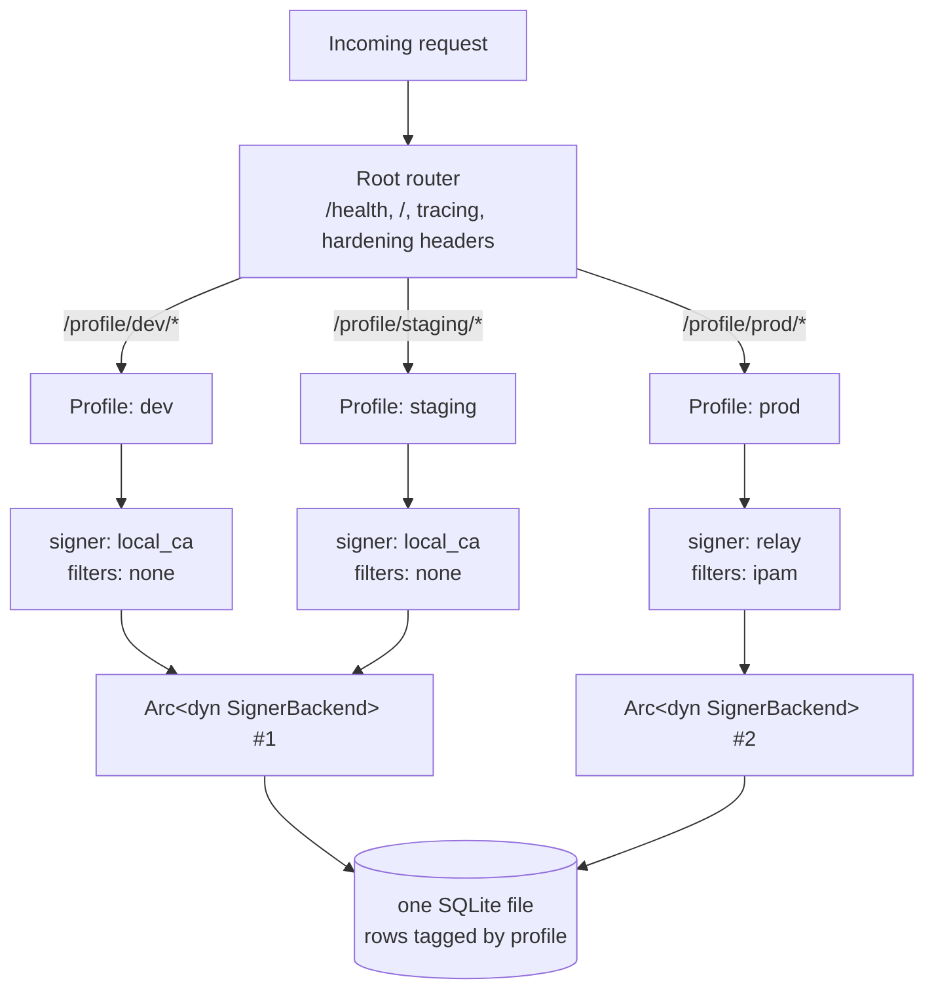
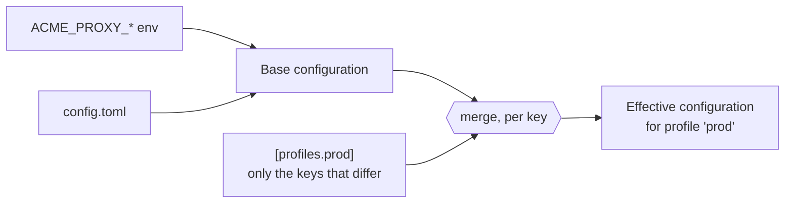

# Profiles

`acme-proxy` is a multi-tenant ACME server. It serves ACME entirely through
**Profiles**.

A single process, running on a single port with a single database, can host
multiple isolated ACME endpoints. Each profile is mounted under the
`/profile/<name>/directory` namespace.

## Why use profiles?
- Serve an internal self-signed CA at `/profile/local/directory` for dev
  environments.
- Serve a strict Let's Encrypt relay at `/profile/prod/directory` for production
  services.
- Apply different network filters (e.g., strict IP allowlists for production,
  bypass for dev) without needing to run multiple binary instances.

## One process, several endpoints

Everything below the router is per profile — its own signer, filters, challenge
validators and EAB policy. Everything above it is shared: one socket, one
database, one process.



Note the **fan-in**: `dev` and `staging` have identical `[signer]` sections, so
they share one backend instance rather than constructing two. That is not an
optimisation detail — two `local_ca` instances over the same files would each
rewrite the CRL from their own in-memory ledger, so two profiles sharing
`ca.key` while differing elsewhere is a startup error rather than a race.

## Hard database isolation
Profiles act as a strict isolation boundary in the SQLite database.

The `accounts` table uses a constraint: `UNIQUE(profile, pubkey)`. This means if
a client registers a key at `/profile/default`, and then uses the exact same
cryptographic key to connect to `/profile/le`, the database creates two
**independent ACME accounts**. This ensures endpoints cannot cross-pollinate
authorizations, orders, or nonces.

## Inheritance and configuration
Profiles inherit from the base (global) configuration keys. A profile only needs
to override the specific keys that differ.

**Eight sections can be overridden**, and no others: `signer`, `filter`,
`ipam`, `challenge`, `eab`, `order`, `notify` and `meta`. Everything else — the
listen socket, the database, logging, audit, the admin listener — is
process-wide.



**Inheritance is per key, not per section.** A profile that sets only
`challenge.bypass` keeps the *global* `challenge.enabled` rather than reverting
it to the compiled default. Arrays, however, replace wholesale — they never
append. Precedence is: profile key, then global key, then compiled default.

That split is why `[filter]` is shaped the way it is. `filter.rules` is an
array, so a profile naming its own rules replaces the sequence outright — which
is right, because order *is* the policy. `[filter.check.<name>]` and
`[filter.rule.<name>]` are tables, so they merge per key, and a profile can
dry-run one rule without restating anything:

```toml
[profiles.staging.filter.rule.inventory-owned]
mode = "warn"
```

A profile inherits every globally defined check and cannot remove one, which
costs nothing: a check no selected rule names is never built. A global
`[filter]` section can therefore carry a library of checks and each profile pick
the subset its own `filter.rules` uses.

```toml
[signer]
backend = "local_ca"

[filter]
rules = ["corp-only"] # The base selection; each profile may replace it

# The library. Both checks and both rules are declared once, globally.
[filter.check.corp-net]
type  = "allowed_ip"
allow = ["10.0.0.0/8"]

[filter.check.corp-names]
type  = "identifiers"
allow = ["*.corp.example.com"]

[filter.rule.corp-only]
when = "corp-net"
then = "allow"

[filter.rule.named-and-corp]
when = "corp-net and corp-names"
then = "allow"

# Profile 1: Uses the global local_ca, and the inherited address-only rule.
# `corp-names` is named by no rule it selects, so it is never built.
[profiles.default]
enabled = true

# Profile 2: Relays to Let's Encrypt, and replaces the selection with the
# stricter rule — which is what pulls `corp-names` into existence here.
[profiles.le]
enabled = true
signer.backend = "relay"
signer.relay.directory_url = "https://acme-v02.api.letsencrypt.org/directory"
filter.rules = ["named-and-corp"]
```

`acme-proxy filter show --profile <name>` prints the built policy for one
profile, which is the quickest way to confirm a profile selected what you
intended. A check that no selected rule names is reported as
`filter_check_unused` — an advisory, not an error.

At runtime, `acme-proxy` deduplicates the signer backends in memory so that two
profiles sharing the exact same signer configuration (e.g., two profiles using
the same `local_ca`) don't duplicate background polling threads or memory
overhead.
