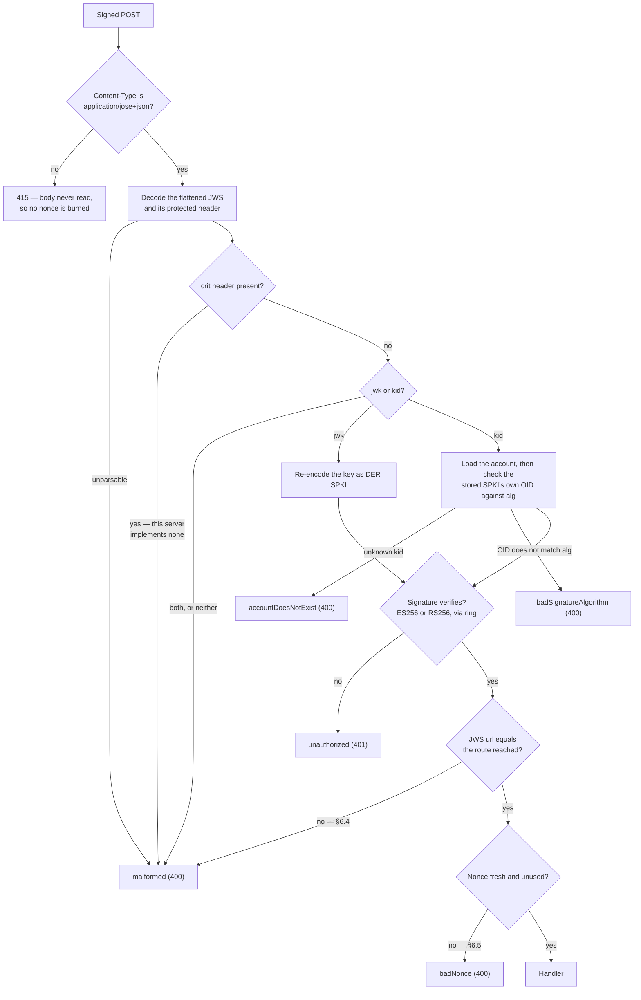
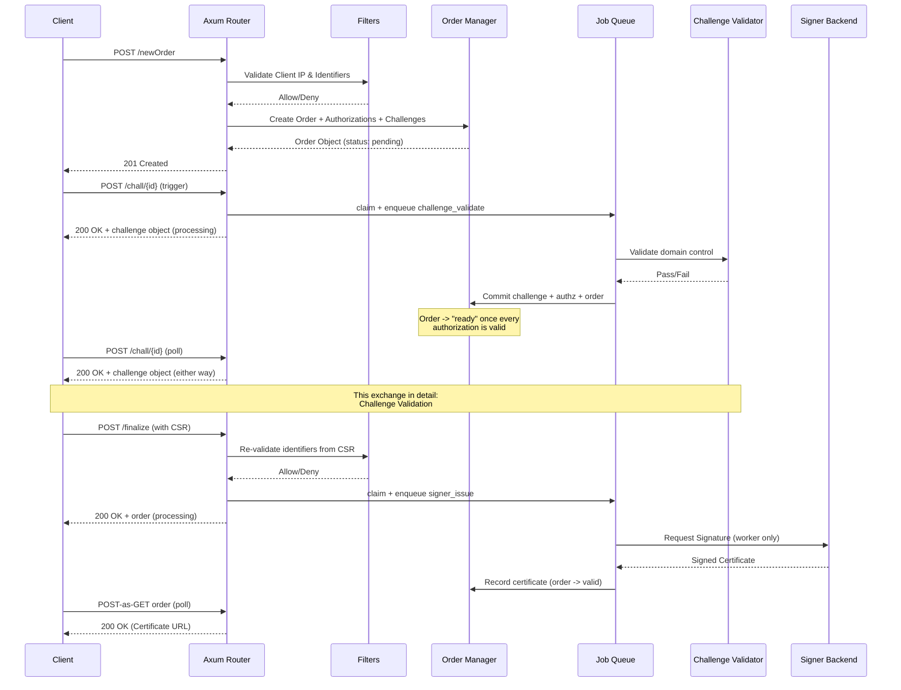
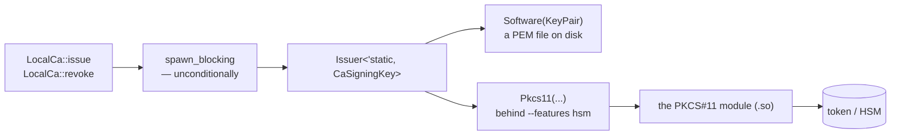

# Architecture

This page is about how the pieces fit, and about the handful of decisions that
are load-bearing enough that changing them would break something non-obvious.
The organising ideas are three: RFC 8555's checks are hoisted into an extractor
so no route can forget them, an ACME endpoint is a profile, and signing,
filtering and notifying are each a trait with several implementations.

## The workspace

One binary over a Cargo workspace. The root package, `acme-proxy`, holds the
`clap` command tree (`src/cli/`), `main.rs` and the integration tests; nine
library crates under `crates/` hold everything else, each naming only the
crates beneath it:

| Crate | What it holds | Depends on |
|---|---|---|
| `acme-proxy-core` | configuration, the ACME wire types, certificate parsing, the audit vocabulary | — |
| `acme-proxy-store` | the SQLite storage layer, one module per table, and the migrations | core |
| `acme-proxy-net` | DNS, outbound HTTP and proxies, TLS, listeners, the challenge validators | core |
| `acme-proxy-policy` | the filter engine and the IPAM inventories | core, net |
| `acme-proxy-jobs` | the job queue, notifications, the audit writer, metrics | core, net, store |
| `acme-proxy-signer` | the signing backends and their read side | core, jobs, net, store |
| `acme-proxy-protocol` | the ACME services, extractors, handlers and routers | all of the above |
| `acme-proxy-admin` | the operation layer and the web admin panel | protocol and below |
| `acme-proxy-server` | the runtime: roles, listeners, reload, logging | all of the above |

The crate edges are the layering: a handler cannot reach the runtime that
serves it, and a job queue cannot reach the filters, because the compiler
refuses the import. `tests/layering.rs` pins each crate's dependencies to this
table, so an edge across a layer — which Cargo would accept — is a deliberate
change rather than a drive-by one.

## Request flow and extractors

Nearly every ACME endpoint is signed by the client using JSON Web Signatures
(JWS). Rather than parsing this manually in each handler, the server leverages
an `AcmeRequest<T>` Extractor.

### The JWS extractor core

Eight checks run in a fixed order, and five of them have their own way out. The
shape matters more than the list: the `jwk`/`kid` branch in the middle is where
the two security properties below live, and a linear numbered list hides it.



Only once all of this succeeds is the request handed to the axum handler.
Hoisting these checks into the extractor makes them structural: a new signed
route cannot forget them, and no handler repeats a four-line preamble.

Three extractors build on that core: `AcmeRequest<T>` (decode and deserialize
the payload), `AcmePostAsGet` (require an empty payload, else `malformed`), and
`AcmeOptionalPayload<T>` — the last exists for the authorization resource, where
one URL serves both a POST-as-GET read and a §7.5.2 deactivation.

### Two security properties worth not breaking

**`jwk` and `kid` are mutually exclusive** (RFC 8555 §6.2) — the branch in the
middle of the diagram. Both present, or neither, is `malformed`. An embedded
`jwk` is verified and re-encoded as DER SPKI; a `kid` is resolved to its account
and verified against the account's **stored** SPKI.

**The verification algorithm never rests on `alg` alone.** On the `kid` path,
the stored SPKI's own `AlgorithmIdentifier` OID is checked against the client's
claimed `alg` before verification — that is the `badSignatureAlgorithm` exit. EC
coordinates must additionally be exactly 32 octets (RFC 7518 §6.2.1.2) — a short
or long one parses as a *different* point, which would register one key as two
accounts.

## Database & persistence

The server uses `sqlx` with `sqlite`.

The connection pool is private to `crates/store/src/`. Everything else reaches
the database through a table module, `Database::transaction()` (a transaction
that derefs to the connection the table methods take) or
`Database::pool_stats()` (the metrics gauge), so SQL and its dialect stay in one
module tree. `Database::raw_pool()` exists only for test fixtures, and
`tests/layering.rs` fails the build when production code calls it.

### Migrations

Migrations are embedded with `sqlx::migrate!()`, frozen once committed, and
applied only by `acme-proxy migrate`/`init` and a process running the `worker`
role; every other entry point refuses a database whose schema is behind. The
rules and the reasons are in
[ADR 0003](adr/0003-migrations-frozen-and-explicit.md), and the how-to in
[Contributing](contributing.md#changing-the-database-schema). The schema is
also the *only* frozen surface before 1.0.0
([ADR 0001](adr/0001-pre-1-0-compatibility.md)).

### Schema details

The tables, their constraints and the reasoning behind each — profile isolation,
the `CHECK`ed state machines, the audit trail's deliberate lack of foreign keys,
and the three different ways a secret is stored — have their own page:
[Database Schema](database.md).

Revocation is the one piece worth naming here, because it constrains the request
path rather than the schema: it writes a reason and a timestamp and deliberately
does not touch the order `status`, since RFC 8555 defines no "revoked" order
status.

## Two front ends, one operation layer

`src/cli/` and `crates/admin/src/webadmin/` are **two front ends**;
`crates/admin/src/admin/` is the operation layer both dispatch to and neither
owns.

```text
src/cli/            crates/admin/src/webadmin/
   (clap)              (axum)
      \                 /
       \               /
        crates/admin/src/admin/ops.rs      — delete_account, revoke_order, load_order_detail…
        crates/admin/src/admin/users.rs    — create_user, authenticate, set_password…
        crates/admin/src/admin/render.rs   — render_*_line (human) / render_*_json (API)
        crates/admin/src/admin/password.rs — the KDF, shared by both
```

A handler in `crates/admin/src/webadmin/handlers/` is a few lines over an
`admin::ops` call and a `render_*_json`, the same way a `src/cli/` command body
is a few lines over the same call and a `render_*_line`. That is what keeps the
password policy, the duplicate check and the rehash-on-login identical between
them.

Two consequences worth knowing:

- **The destructive operations come in pairs.** `delete_account(id, db)` simply
  deletes; `confirm_delete_account(id, yes, reader, db)` asks first. The split
  exists because `assume_yes: bool` + `reader: &mut impl BufRead` are a
  terminal's concerns — a caller with no terminal was passing `true` and an
  empty reader, asserting a confirmation that never happened. The CLI calls the
  wrapper; the web calls the bare form.
- **`crates/admin/src/webadmin/` is not `crates/admin/src/admin/web/`.** That
  would invert the dependency, putting an HTTP server inside the operation
  layer.

The admin listener is assembled by `webadmin::build_admin_app`, which takes
`&[Arc<Profile>]` as a **slice** — `build_app` consumes the `Vec`, so the admin
side must be built first, and the signature is where that ordering is stated
rather than a borrow error to rediscover. Its state is `AdminState`, not
`AppState`: the latter holds exactly one `Profile`, and this listener is
cross-profile by nature (revoking an order needs *that order's own* profile's
revocation route, which may name a different CA from any default).

## Order lifecycle



Three transactional properties hold this together:

- Order creation inserts the order, its authorizations and their challenges in
  **one transaction**. A half-written order would be finalizable for names that
  were never authorized.
- A validation outcome commits the challenge, the authorization and the order
  **together**, and the "is every authorization valid?" read happens *inside*
  that transaction. From the pool, two concurrent validations of one order could
  each read before the other's write landed, and neither would promote the order
  to `ready`.
- Challenge validation returns **`200` plus the challenge object whether it
  passed or failed** (§7.5.1). A 4xx would surface as a transport failure to
  certbot's `acme` library rather than as a failed challenge.
- `finalize` claims the order (`ready → processing`) and queues its
  `signer_issue` job in **one transaction**, so no crash can leave an order
  `processing` with nothing coming to settle it. The job runs in the `worker`
  role — the only one that builds a signing backend — which is what keeps the
  CA key out of the process parsing client requests.


## Pluggable signing keys

The [`SignerBackend`](../signers/index.md) trait is the seam for *how a
certificate is obtained* — locally, from an upstream ACME server, or from a
script. Inside the `local_ca` backend there is a second, narrower seam for
*where the private key lives*, and it is worth knowing that it is **rcgen's own
trait, not one this project invented**.



The `spawn_blocking` sits **before** the branch, not inside one arm of it: see
the first consequence below.

`rcgen::SigningKey` is public, and every signing entry point `local_ca` uses is
generic over it:

| call | signature |
|---|---|
| `csr.signed_by(&issuer)` | `signed_by(&self, issuer: &Issuer<impl SigningKey>)` |
| `CertificateRevocationListParams::signed_by(&issuer)` | `signed_by(&self, issuer: &Issuer<'_, impl SigningKey>)` |
| `params.self_signed(&key)` | `self_signed(&self, signing_key: &impl SigningKey)` |

So `LocalCa` holds an `Issuer<'static, CaSigningKey>` — a small enum in
`crates/signer/src/local_ca/key.rs` with a `Software(KeyPair)` variant and,
behind the `hsm` feature, a `Pkcs11(..)` one. Adding a key source (a cloud KMS,
a remote signer daemon) means adding a variant that implements two rcgen trait
methods: `sign`, `der_bytes`/`algorithm`. Nothing in `issue`, `revoke`,
`crl_der` or the CSR sanitisation changes, because none of it ever names the key
type.

Two consequences worth preserving:

- **Signing runs on the blocking pool.** `rcgen::SigningKey::sign` is
  synchronous and called from deep inside `signed_by`, so there is nothing to
  await through. A key source that talks to hardware or a network would
  otherwise stall a runtime worker for its whole round trip, so `LocalCa::issue`
  and the CRL rebuild in `revoke` both go through `spawn_blocking`
  unconditionally — not gated on the variant, which would be a branch someone
  eventually gets wrong.
- **The key type must be `Send + Sync`.** It lives inside an `Arc<dyn
  SignerBackend>`. Where the underlying handle is not (cryptoki's `Session` is
  `Send` but not `Sync`), a `std::sync::Mutex` is the right wrapper: the signing
  call never awaits, so an async mutex would buy nothing.
