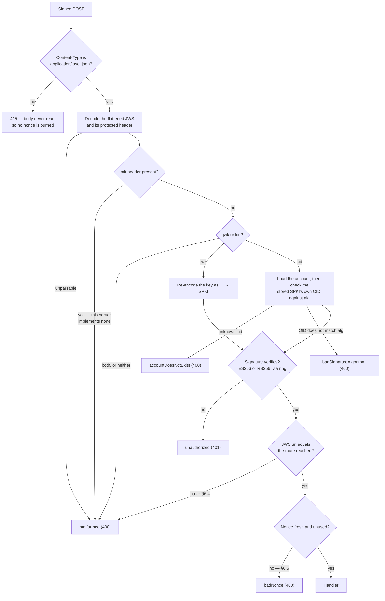
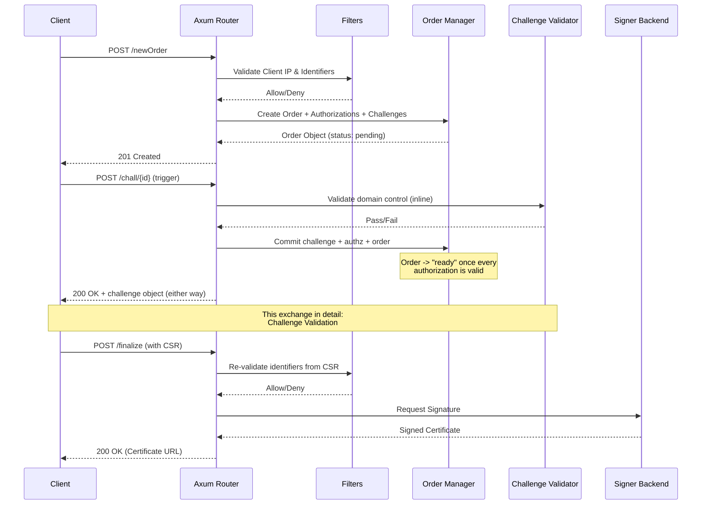
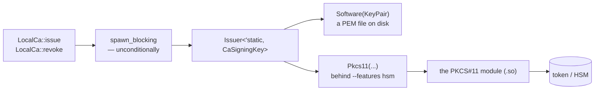

# Architecture

This page is about how the pieces fit, and about the handful of decisions that
are load-bearing enough that changing them would break something non-obvious.
The organising ideas are three: RFC 8555's checks are hoisted into an extractor
so no route can forget them, an ACME endpoint is a profile, and signing,
filtering and notifying are each a trait with several implementations.

## Request flow and extractors

Nearly every ACME endpoint is signed by the client using JSON Web Signatures
(JWS). Rather than parsing this manually in each handler, the server leverages
an `AcmeRequest<T>` Extractor.

### The JWS extractor core

Eight checks run in a fixed order, and five of them have their own way out. The
shape matters more than the list: the `jwk`/`kid` branch in the middle is where
the two security properties below live, and a linear numbered list hides it.



Only once all of this succeeds is the request handed to the axum handler.
Hoisting these checks into the extractor makes them structural: a new signed
route cannot forget them, and no handler repeats a four-line preamble.

Three extractors build on that core: `AcmeRequest<T>` (decode and deserialize
the payload), `AcmePostAsGet` (require an empty payload, else `malformed`), and
`AcmeOptionalPayload<T>` — the last exists for the authorization resource, where
one URL serves both a POST-as-GET read and a §7.5.2 deactivation.

### Two security properties worth not breaking

**`jwk` and `kid` are mutually exclusive** (RFC 8555 §6.2) — the branch in the
middle of the diagram. Both present, or neither, is `malformed`. An embedded
`jwk` is verified and re-encoded as DER SPKI; a `kid` is resolved to its account
and verified against the account's **stored** SPKI.

**The verification algorithm never rests on `alg` alone.** On the `kid` path,
the stored SPKI's own `AlgorithmIdentifier` OID is checked against the client's
claimed `alg` before verification — that is the `badSignatureAlgorithm` exit. EC
coordinates must additionally be exactly 32 octets (RFC 7518 §6.2.1.2) — a short
or long one parses as a *different* point, which would register one key as two
accounts.

## Database & persistence

The server uses `sqlx` with `sqlite`.

### Migrations
Database migrations are embedded into the binary using `sqlx::migrate!()` and
run automatically at startup. The database connects with two crucial pragmas:
- `foreign_keys = ON`: Ensures the `ON DELETE CASCADE` constraints work,
  allowing accounts and orders to be genuinely deleted without leaving orphans.
- `journal_mode = WAL`: Write-Ahead Logging allows high concurrency, crucial
  because every single request consumes and mints a nonce.

**The migration set is frozen as of 0.1.0 and append-only from here.** A schema
change is a new `sqlx migrate add` file, never an edit to a committed one:
`sqlx` records each migration's checksum, so editing a file that has already run
somewhere fails that deployment at startup. See
[Contributing](contributing.md#changing-the-database-schema) for the two
consequences that catch people out — a new column is a new file, and a new
`CHECK`/`UNIQUE`/foreign key needs a full table rebuild because SQLite cannot
add one in place.

Because upgrading is therefore just "run the new binary against the existing
database", there is no separate upgrade procedure and no dump/restore step. The
schema is also the *only* frozen surface before 1.0.0 — configuration keys and
the rest may still move, which is what
[Compatibility](https://github.com/acme-proxy/acme-proxy/blob/main/CHANGELOG.md#compatibility)
sets out.

### Schema details

The tables, their constraints and the reasoning behind each — profile isolation,
the `CHECK`ed state machines, the audit trail's deliberate lack of foreign keys,
and the three different ways a secret is stored — have their own page:
[Database Schema](database.md).

Revocation is the one piece worth naming here, because it constrains the request
path rather than the schema: it writes a reason and a timestamp and deliberately
does not touch the order `status`, since RFC 8555 defines no "revoked" order
status.

## Two front ends, one operation layer

`src/cli/` and `src/webadmin/` are **two front ends**; `src/admin/` is the
operation layer both dispatch to and neither owns.

```text
src/cli/            src/webadmin/
   (clap)              (axum)
      \                 /
       \               /
        src/admin/ops.rs      — delete_account, revoke_order, load_order_detail…
        src/admin/users.rs    — create_user, authenticate, set_password…
        src/admin/render.rs   — render_*_line (human) / render_*_json (API)
        src/admin/password.rs — the KDF, shared by both
```

A handler in `src/webadmin/handlers/` is a few lines over an `admin::ops` call
and a `render_*_json`, the same way a `src/cli/` command body is a few lines
over the same call and a `render_*_line`. That is what keeps the password
policy, the duplicate check and the rehash-on-login identical between them.

Two consequences worth knowing:

- **The destructive operations come in pairs.** `delete_account(id, db)` simply
  deletes; `confirm_delete_account(id, yes, reader, db)` asks first. The split
  exists because `assume_yes: bool` + `reader: &mut impl BufRead` are a
  terminal's concerns — a caller with no terminal was passing `true` and an
  empty reader, asserting a confirmation that never happened. The CLI calls the
  wrapper; the web calls the bare form.
- **`src/webadmin/` is not `src/admin/web/`.** That would invert the dependency,
  putting an HTTP server inside the operation layer.

The admin listener is assembled by `webadmin::build_admin_app`, which takes
`&[Arc<Profile>]` as a **slice** — `build_app` consumes the `Vec`, so the admin
side must be built first, and the signature is where that ordering is stated
rather than a borrow error to rediscover. Its state is `AdminState`, not
`AppState`: the latter holds exactly one `Profile`, and this listener is
cross-profile by nature (revoking an order needs *that order's own* profile's
signer, which may be a different CA from any default).

## Order lifecycle



Three transactional properties hold this together:

- Order creation inserts the order, its authorizations and their challenges in
  **one transaction**. A half-written order would be finalizable for names that
  were never authorized.
- A validation outcome commits the challenge, the authorization and the order
  **together**, and the "is every authorization valid?" read happens *inside*
  that transaction. From the pool, two concurrent validations of one order could
  each read before the other's write landed, and neither would promote the order
  to `ready`.
- Challenge validation returns **`200` plus the challenge object whether it
  passed or failed** (§7.5.1). A 4xx would surface as a transport failure to
  certbot's `acme` library rather than as a failed challenge.


## Pluggable signing keys

The [`SignerBackend`](../signers/index.md) trait is the seam for *how a
certificate is obtained* — locally, from an upstream ACME server, or from a
script. Inside the `local_ca` backend there is a second, narrower seam for
*where the private key lives*, and it is worth knowing that it is **rcgen's own
trait, not one this project invented**.



The `spawn_blocking` sits **before** the branch, not inside one arm of it: see
the first consequence below.

`rcgen::SigningKey` is public, and every signing entry point `local_ca` uses is
generic over it:

| call | signature |
|---|---|
| `csr.signed_by(&issuer)` | `signed_by(&self, issuer: &Issuer<impl SigningKey>)` |
| `CertificateRevocationListParams::signed_by(&issuer)` | `signed_by(&self, issuer: &Issuer<'_, impl SigningKey>)` |
| `params.self_signed(&key)` | `self_signed(&self, signing_key: &impl SigningKey)` |

So `LocalCa` holds an `Issuer<'static, CaSigningKey>` — a small enum in
`src/signer/local_ca/key.rs` with a `Software(KeyPair)` variant and, behind the
`hsm` feature, a `Pkcs11(..)` one. Adding a key source (a cloud KMS, a remote
signer daemon) means adding a variant that implements two rcgen trait methods:
`sign`, `der_bytes`/`algorithm`. Nothing in `issue`, `revoke`, `crl_der` or the
CSR sanitisation changes, because none of it ever names the key type.

Two consequences worth preserving:

- **Signing runs on the blocking pool.** `rcgen::SigningKey::sign` is
  synchronous and called from deep inside `signed_by`, so there is nothing to
  await through. A key source that talks to hardware or a network would
  otherwise stall a runtime worker for its whole round trip, so `LocalCa::issue`
  and the CRL rebuild in `revoke` both go through `spawn_blocking`
  unconditionally — not gated on the variant, which would be a branch someone
  eventually gets wrong.
- **The key type must be `Send + Sync`.** It lives inside an `Arc<dyn
  SignerBackend>`. Where the underlying handle is not (cryptoki's `Session` is
  `Send` but not `Sync`), a `std::sync::Mutex` is the right wrapper: the signing
  call never awaits, so an async mutex would buy nothing.
