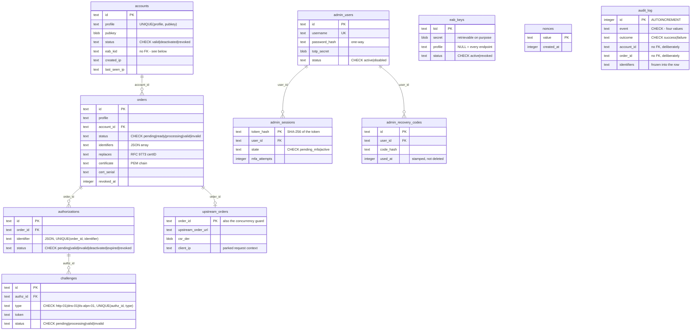

# Database Schema

`acme-proxy` stores everything in one SQLite file — accounts, orders, the audit
trail and the web admin's own operators. There is no second datastore and no
cache. This page describes what is in it and why, for anyone reading the
database directly, writing a migration, or trying to understand what a delete
cascades to.

The migration set is **frozen and append-only as of 0.1.0**: a schema change is
a new `sqlx migrate add` file, never an edit to a committed one. See
[Contributing](contributing.md#changing-the-database-schema) for the two
consequences that catch people out.

## The tables at a glance



The diagram has three clusters, and **the two things worth noticing are the
edges that are not drawn**:

- The ACME graph — `accounts → orders → authorizations → challenges`, with
  `upstream_orders` hanging off an order and `eab_keys` and `nonces` standing
  alone.
- `audit_log`, connected to nothing. That is policy, not an omission.
- The admin island — `admin_users` and its two children — which never joins to
  `accounts`. An `admin_users` row is an operator of this server; an `accounts`
  row is a client key that asks it for certificates. They are different
  populations and the schema says so.

## Profiles are a database boundary

`accounts.profile` and `orders.profile` are `NOT NULL`, and `accounts` is keyed
`UNIQUE(profile, pubkey)`. One client key presenting itself at two endpoints is
**two independent accounts** with separate orders and separate authorizations —
see [Profiles & Routing](../core/profiles.md).

`eab_keys.profile` is the one nullable member of the set, and `NULL` means
"valid at every endpoint" rather than "unknown".

Request-path lookups always take the profile. The admin CLI deliberately uses
unscoped lookups (`find_any_by_id`, `find_any_by_kid`), because an operator
holding an id wants the row, not a reminder about which endpoint it belongs to.

## Every foreign key is indexed and cascades

SQLite indexes primary keys and `UNIQUE` constraints and nothing else, so before
`20260727120000_indexes_and_constraints.sql` every order read and every
challenge trigger was a full table scan. That migration rebuilt the four ACME
tables to add both halves at once:

- `ON DELETE CASCADE` on every foreign key, so an account or an order can
  genuinely be deleted. This depends on the `foreign_keys` pragma, which
  `Database::connect` pins on — see [Architecture](architecture.md#migrations).
- An index on every foreign key: `idx_orders_account_id`,
  `idx_authorizations_order`, `idx_challenges_authz`.

Two later indexes serve one query each: `idx_orders_cert_serial` on `(profile,
cert_serial)`, which `POST /revokeCert` uses on every request, and
`idx_orders_created_at` / `idx_orders_status_created_at`, which the web admin's
newest-first cross-account listing needs and the ACME path never did.

`idx_orders_replaces_claim` is different — it is a **partial unique** index on
`(profile, replaces)` where `replaces IS NOT NULL AND status != 'invalid'`. It
is not a lookup index at all; it is RFC 9773 §5's "already replaced?" rule
enforced in SQL, which is what makes `409 alreadyReplaced` race-free and what
lets an order that fails release its claim. See
[Renewal Information](../features/renewal_info.md).

## `CHECK` constraints hold the state machines

Five columns carry a `CHECK (… IN (…))`: `accounts.status`, `orders.status`,
`authorizations.status`, `challenges.status` and `challenges.type`, plus
`eab_keys.status`, `admin_users.status`, `admin_sessions.state`, and
`audit_log`'s `event`, `outcome` and `actor_kind`.

They are there because status transitions are raw string literals spread across
several modules. A typo would otherwise park a row in a state nothing can read
back, and the row would look fine. With the constraint it is a failed write at
the moment of the mistake.

This is also why a new `CHECK` is expensive: SQLite cannot add one to an
existing table, so it needs a full table rebuild in a new migration. Several
constraints were therefore declared before anything wrote them —
`admin_users.totp_secret`/`totp_pending_secret`/`totp_last_step` and
`admin_sessions.state`'s `'pending_mfa'` value are the worked example, added in
`20260808120000` and only used once the second factor shipped.

## The audit trail has no foreign keys, deliberately

`audit_log` names an `account_id` and an `order_id` with no constraint behind
either. An audit row has to survive the account or order it describes being
deleted — a `CASCADE` there would destroy the evidence along with its subject,
which is the one thing an audit trail may not do. The identifiers are frozen
into the row for the same reason, rather than being read back through a join
that may no longer resolve.

Two more consequences of that decision:

- `id` is `INTEGER PRIMARY KEY AUTOINCREMENT`, not a plain rowid. An operator
  types this id, and `AUTOINCREMENT` is what stops SQLite handing out the rowid
  of a purged row a second time.
- `outcome` is denormalized from `event` and written from the single definition
  in `AuditEvent::outcome`, so "show me everything that was refused" is an index
  lookup rather than `event LIKE '%_failed'` written out in three front ends.

Rows are only ever `INSERT`ed. There is no setter and no `UPDATE` against this
table anywhere in the crate; the only statement that removes anything is the
retention sweep. See [Audit Trail](../operations/audit.md).

`accounts.eab_kid` is a similar deliberate non-key: it records which credential
was used at registration, but an EAB credential is revocable and the account
outlives it, so there is no constraint tying the two together.

## Secrets are stored three different ways, on purpose

The three storage shapes in this schema are not an inconsistency — each one
follows from what the server has to do with the value later.

| Column | Shape | Why |
| --- | --- | --- |
| `eab_keys.secret` | Raw bytes, retrievable | HMAC verification needs the *same* secret back on every request. A lost one is replaced, never recovered — `eab create` prints it once. |
| `admin_users.password_hash` | One-way KDF (PBKDF2-HMAC-SHA256), unreadable | A password is only ever compared. No code path can read it out. |
| `admin_sessions.token_hash` | `hex(SHA-256(token))`, no KDF | A 256-bit CSPRNG token has no dictionary to slow down. The hash exists solely so a database read yields nothing replayable. |

`admin_recovery_codes.code_hash` follows the password shape — a recovery code is
only ever compared. It is a table rather than a JSON column so that consuming
one is `UPDATE … WHERE id = ? AND used_at IS NULL` with `rows_affected` deciding
a race, the same primitive `nonces` uses. `used_at` is stamped rather than
deleted, so "7 of 10 remaining" is a count and a spent code leaves a trail.

`admin_users.totp_secret` and `totp_pending_secret` are **plaintext BLOBs on
purpose**: verification recomputes the HMAC, so the server needs the same bytes
back every attempt. That is `eab_keys.secret`'s situation, not a password's, and
any wrapping key would live in the same directory as the database.

## Columns nothing ever compares against

`accounts.created_ip`/`created_ptr`/`last_seen_ip`/`last_seen_ptr`,
`orders.created_ip`/`created_ptr`, `admin_sessions.created_ip`/`user_agent`, and
`audit_log`'s `client_ip`/`client_ptr`/`user_agent` are **forensics only**. No
code path compares a live request against any of them.

That is a decision, not an oversight. Pinning an identity to an address breaks
CGNAT and mobile clients; pinning it to a User-Agent breaks on the next browser
update. They answer "who asked for this, and from where" after the fact, and
nothing else.

None of them reaches an ACME object either — the wire format is RFC 8555's and
stays that way. They surface through the admin CLI and the web admin only.

## Reading it directly

The file is `sqlite.db` by default and is opened in **WAL mode**, so there are
normally `sqlite.db-wal` and `sqlite.db-shm` beside it. Copying only `sqlite.db`
gives you a database missing every recent write; back up all three, or use
`sqlite3 sqlite.db ".backup backup.db"`, which is consistent by construction.

```bash
# What has this account been issued?
sqlite3 sqlite.db "SELECT id, status, identifiers, datetime(created_at,'unixepoch')
                     FROM orders WHERE account_id = '…' ORDER BY created_at DESC;"

# Everything refused in the last day.
sqlite3 sqlite.db "SELECT datetime(created_at,'unixepoch'), event, profile, client_ip, reason
                     FROM audit_log WHERE outcome = 'failure'
                      AND created_at > strftime('%s','now','-1 day');"

# Which migrations have run.
sqlite3 sqlite.db "SELECT version, description, success FROM _sqlx_migrations;"
```

Read-only inspection of a running server is safe under WAL. Writing to the
database behind the server's back is not — the `CHECK` constraints will catch a
bad status, but nothing will re-sync the in-memory state a handler is holding.
Use the [Admin CLI](../operations/cli.md) instead.
