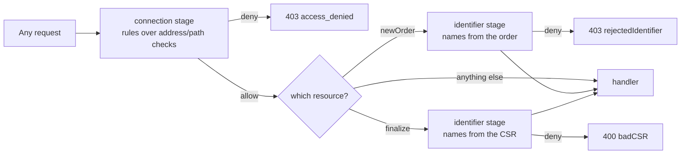

# Filters

Filters provide access control for `acme-proxy`. They restrict which clients can
reach the server and which identifiers (e.g. DNS names) those clients can
request certificates for.

`[filter]` is a small policy engine with two halves:

- a **check** is one named question about a request — "is this address in the
  management network?", "does the inventory say this address owns this name?".
  Each is a `[filter.check.<name>]` with a `type` saying which question it asks.
- a **rule** is a boolean expression over check names plus what a match means.
  Each is a `[filter.rule.<name>]`, and `filter.rules` lists the ones to
  evaluate, in order. **First match wins.**

Everything is a named check — `custom` included — and two checks of the same
type are ordinary rather than impossible.

```toml
[filter]
rules = ["mgmt-bypass", "inventory-owned"]

[filter.check.mgmt-net]
type  = "allowed_ip"
allow = ["10.0.0.0/8"]

[filter.check.corp-names]
type  = "identifiers"
allow = ["*.corp.example.com", "corp.example.com"]

[filter.check.inventory]
type = "ipam"

[filter.rule.mgmt-bypass]
when = "mgmt-net"
then = "allow"

[filter.rule.inventory-owned]
when    = "corp-names and (inventory or mgmt-net)"
then    = "allow"
message = "this address owns no such name in the inventory"
```

See [Policy: rules and conditions](policy.md) for the condition language and how
rules are evaluated, and [Checks](checks.md) for the types and their keys.

## The two hooks

A check can act at two points, and both default to "pass" for a check that does
not implement them:

- **the connection stage** — runs on every request, before anything else.
  Refusal is `403 access_denied`.
- **the identifier stage** — runs at `newOrder` *and* again at `finalize`
  against the names projected out of the CSR. It runs **after** the account is
  resolved, so a check can bind names to an account as well as to an address.
  Refusal is `403 rejectedIdentifier` at `newOrder`, `400 badCSR` at `finalize`.

Checking again at `finalize` is what stops a client from passing a benign
`newOrder` and then smuggling extra names into the CSR:



**Both stages must allow.** They are evaluated independently, each over the
subset of rules that can run there, so a connection-stage `allow` does not skip
the identifier stage. A stage no rule applies to allows without consulting
`filter.default` — otherwise a policy made entirely of `identifiers` checks
would refuse every request before a name had been mentioned.

## Available check types

| Type | Stage(s) | Purpose |
| --- | --- | --- |
| [`allowed_ip`](allowed_ip.md) | both | CIDR allow/deny on the client address |
| [`path`](path.md) | connection | Glob allow/deny on the request path |
| [`reverse_dns`](reverse_dns.md) | connection | PTR lookup with optional forward confirmation |
| [`identifiers`](identifiers.md) | identifiers | Glob or regex allow/deny on requested names |
| [`eab`](eab.md) | identifiers | Which EAB credential the account registered under |
| [`ipam`](../ipam/index.md) | identifiers | Ask an IPAM whether the client owns the names |
| [`custom`](custom.md) | both | Shell out to an operator-supplied script |

`allowed_ip` reads nothing but the client address, which both stages carry, and
that is what makes `mgmt-net or inventory` writable at all: the address half is
still answerable at the point where the inventory is consulted.

## Seeing what a policy does

`acme-proxy filter show` prints the resolved policy, with every condition
re-parenthesized so you can see what the parser understood. `acme-proxy filter
explain` evaluates it against a hypothetical request and reports each check's
verdict, which rule matched, and the HTTP answer. See
[the CLI reference](../operations/cli.md).

### Reference

**`rules`** (`Array`) — *Default: `[]` | Env: `ACME_PROXY_FILTER__RULES`*

Which `[filter.rule.<name>]` entries to evaluate, and in what order. Empty means
no filtering at all — anyone who can reach the server can obtain a certificate
if they satisfy the challenges (or, with `challenge.bypass` on, with no proof at
all). The server logs a `filter_disabled` warning at startup saying so.

**`default`** (`String`) — *Default: `"deny"` | Env: `ACME_PROXY_FILTER__DEFAULT`*

What happens at a stage where a rule was applicable and none of them matched:
`"allow"` or `"deny"`. Never consulted at a stage no rule applies to.

**`trusted_proxies`** (`Array`) — *Default: `[]` | Env: `ACME_PROXY_FILTER__TRUSTED_PROXIES`*

CIDRs (or bare addresses) whose forwarded-for header is believed. A request from
any other peer is attributed to its own address, and its forwarded header is
ignored. Note this is a **`[filter]`** key — placing it under `[server]`
silently does nothing.

**`forwarded_header`** (`String`) — *Default: `"x-forwarded-for"` | Env: `ACME_PROXY_FILTER__FORWARDED_HEADER`*

The header consulted for the forwarded client address.

## Fail-closed semantics

Every check that depends on the client address fails **closed** when it cannot
determine one — including in deny-only (blocklist) mode. An address the server
cannot see is not "absent from the deny list, therefore fine".

This makes one deployment detail load-bearing: the server must be served with
connection info attached, which it is by default. Behind a reverse proxy, set
`trusted_proxies` — otherwise every request is correctly, but unhelpfully,
attributed to the proxy.

A check that cannot *reach* its authority — a DNS timeout, an unreachable
inventory — is a third answer, neither pass nor fail, and becomes a retryable
`500` rather than a refusal the client would believe permanent. What that means
for a policy built out of `or` is worth reading in
[Policy](policy.md#when-a-check-cannot-decide).

## Keys the policy engine replaced

Each of these is refused **by name** at startup, so a configuration written
against the older shape stops the server rather than coming up looking
configured and filtering nothing.

| Removed | Replacement |
| --- | --- |
| `filter.enabled` | Declare each filter as a `[filter.check.<name>]` with a `type`, write a `[filter.rule.<name>]` naming them, list it in `filter.rules`. |
| `filter.exempt_paths` | A [`path`](path.md) check plus a rule — which can also combine the path with an address, and can glob. |
| `filter.custom_enabled` | `custom` is an ordinary check type; `filter.rules` already says which run and in what order. |
| `[filter.allowed_ip]`, `[filter.reverse_dns]`, `[filter.identifiers]`, `[filter.custom.<name>]` | The type's keys move onto its `[filter.check.<name>]` entry. |
