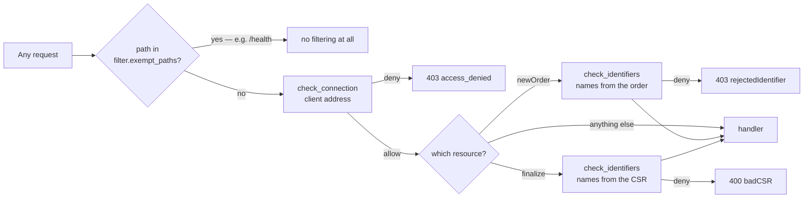

# Filters

Filters provide access control for `acme-proxy`. They restrict which clients can
reach the server and which identifiers (e.g. DNS names) those clients can
request certificates for.

Filters run in the order they are listed in `filter.enabled`. **All** enabled
filters must pass; the first denial wins.

## The two hooks

Every filter can act at two points, and both default to "allow" for filters that
do not implement them:

- **`check_connection`** — runs on every non-exempt request, before anything
  else. Refusal is `403 access_denied`.
- **`check_identifiers`** — runs at `newOrder` *and* again at `finalize` against
  the names projected out of the CSR. It runs **after** the account is resolved,
  so a filter can bind names to an account as well as to an IP. Refusal is `403
  rejectedIdentifier` at `newOrder`, `400 badCSR` at `finalize`.

Checking again at `finalize` is what stops a client from passing a benign
`newOrder` and then smuggling extra names into the CSR. It is the same filter
chain appearing twice on one request path:



`exempt_paths` is matched against the **profile-stripped** path, so `/health`
covers it at every endpoint.

## Available filters

| Name | Hook(s) | Purpose |
| --- | --- | --- |
| [`allowed_ip`](allowed_ip.md) | connection | CIDR allow/deny on the client address |
| [`reverse_dns`](reverse_dns.md) | connection | PTR lookup with optional forward confirmation |
| [`identifiers`](identifiers.md) | identifiers | Regex allow/deny on requested names |
| [`netbox`](netbox.md) | identifiers | Ask NetBox whether the client owns the names |
| [`custom`](custom.md) | both | Shell out to an operator-supplied script |

## Configuration

```toml
[filter]
# Which filters run, in evaluation order. Empty (the default) = no filtering.
enabled = ["allowed_ip", "identifiers"]

# Which [filter.custom.<name>] entries run, when "custom" is listed above.
custom_enabled = []

# Paths that skip connection-level filtering, matched against the
# profile-stripped path.
exempt_paths = []

# Reverse proxies whose forwarded-for header is believed.
trusted_proxies = ["10.0.0.0/8"]
forwarded_header = "x-forwarded-for"
```

### Reference

**`enabled`** (`Array`) — *Default: `[]` | Env: `ACME_PROXY_FILTER__ENABLED`*

Filters to activate, in evaluation order. Known names: `allowed_ip`,
`reverse_dns`, `identifiers`, `netbox`, `custom`. Empty means no filtering at
all — anyone who can reach the server can obtain a certificate if they satisfy
the challenges (or if `challenge.bypass` is on, with no proof at all).

**`custom_enabled`** (`Array`) — *Default: `[]` | Env: `ACME_PROXY_FILTER__CUSTOM_ENABLED`*

Which `[filter.custom.<name>]` entries to run, and in what order. See
[Custom Script Filter](custom.md).

**`exempt_paths`** (`Array`) — *Default: `[]` | Env: `ACME_PROXY_FILTER__EXEMPT_PATHS`*

Paths that skip connection-level filtering. Matching is done against the path
**with the `/profile/<name>` prefix stripped**, so `/directory` — not
`/profile/default/directory` — is the value to list.

You rarely need this: server-level routes such as `GET /health` are served by
the root router, which no profile's filters ever see, so they are already
unfiltered. The mechanism remains for an operator who wants to leave, say,
`/directory` open while filtering everything else.

**`trusted_proxies`** (`Array`) — *Default: `[]` | Env: `ACME_PROXY_FILTER__TRUSTED_PROXIES`*

CIDRs (or bare addresses) whose forwarded-for header is believed. A request from
any other peer is attributed to its own address, and its forwarded header is
ignored. Note this is a **`[filter]`** key — placing it under `[server]`
silently does nothing.

**`forwarded_header`** (`String`) — *Default: `"x-forwarded-for"` | Env: `ACME_PROXY_FILTER__FORWARDED_HEADER`*

The header consulted for the forwarded client address.

## Fail-closed semantics

Every filter that depends on the client address fails **closed** when it cannot
determine one — including in deny-only (blocklist) mode. An address the server
cannot see is not "absent from the deny list, therefore fine".

This makes one deployment detail load-bearing: the server must be served with
connection info attached, which it is by default. Behind a reverse proxy, set
`trusted_proxies` — otherwise every request is correctly, but unhelpfully,
attributed to the proxy.
