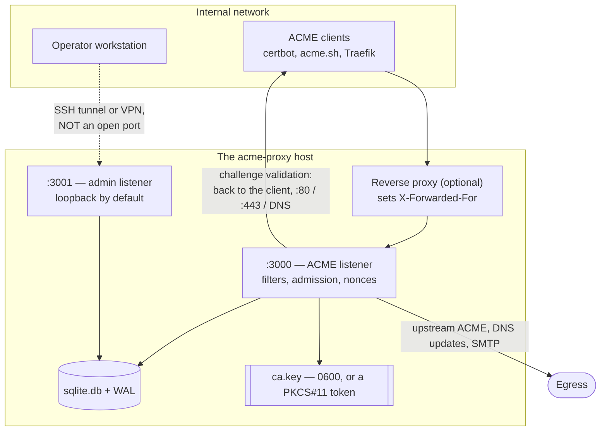

# Deployment

While `acme-proxy` can be run in a container, many organizations prefer running
infrastructure components directly on standard Linux VMs using `systemd`.

## systemd service setup

Below is an example `systemd` service file that runs `acme-proxy` securely.

1. **Create a dedicated user:**
   ```bash
   sudo useradd -r -s /bin/false acme-proxy
   ```

2. **Prepare directories:**
   ```bash
   sudo mkdir -p /etc/acme-proxy
   sudo mkdir -p /var/lib/acme-proxy
   sudo chown acme-proxy:acme-proxy /var/lib/acme-proxy
   ```

3. **Create the service file:** Create `/etc/systemd/system/acme-proxy.service`:

   ```ini
   [Unit]
   Description=ACME Proxy Server
   After=network.target

   [Service]
   Type=simple
   User=acme-proxy
   Group=acme-proxy
   ExecStart=/usr/local/bin/acme-proxy serve
   ExecReload=/bin/kill -HUP $MAINPID
   WorkingDirectory=/var/lib/acme-proxy

   # Configuration. The extension may be omitted, in which case the format
   # is inferred.
   Environment="ACME_PROXY_CONFIG=/etc/acme-proxy/config.toml"
   Environment="ACME_PROXY_DATABASE__URL=sqlite:///var/lib/acme-proxy/acme.db"

   # Security / Sandboxing
   ProtectSystem=strict
   ReadWritePaths=/var/lib/acme-proxy
   ProtectHome=true
   PrivateTmp=true
   NoNewPrivileges=true

   Restart=on-failure
   RestartSec=5

   [Install]
   WantedBy=multi-user.target
   ```

`ProtectSystem=strict` makes the whole filesystem read-only except
`ReadWritePaths`, so everything the server writes must land in
`/var/lib/acme-proxy`. With `WorkingDirectory` set there, the defaults already
do: `signer.local_ca.cert_path` (`ca.pem`), `key_path` (`ca.key`), `crl_path`
(`ca.crl`) and its `.json` ledger sidecar are all resolved relative to the
working directory, as are `server.tls.cert_path` / `key_path` if you enable TLS.
If you set any of them to an absolute path, add that path to `ReadWritePaths`
too.

   > `acme-proxy` shuts down gracefully on `SIGTERM` (and on Ctrl+C when run in
   > a terminal), so `systemctl restart` and `systemctl stop` let in-flight
   > requests finish rather than cutting them off. Both listeners stop together.
   >It also reloads its configuration on `SIGHUP` without moving either socket,
   >which is what the `ExecReload` line above wires up — see [Reloading the
   >Configuration](../operations/reload.md) for what a reload may change and
   >what it refuses.
   >One case still deserves a quiet period: challenge validation and the
   >`custom` signer script run *inside* a request, so a restart during one waits
   >up to `challenge.timeout_ms` or `signer.custom.timeout_ms`. If systemd's
   >`TimeoutStopSec` (90 s by default) is shorter than your
   >`server.request_timeout_ms`, systemd sends `SIGKILL` first and the graceful
   >path is skipped — raise it, or lower the request timeout.

4. **Enable and start the service:**
   ```bash
   sudo systemctl daemon-reload
   sudo systemctl enable --now acme-proxy
   ```

## Where each socket belongs

`acme-proxy` opens **two** listeners when the web admin is enabled, and they
belong on different sides of your boundary. The ACME listener answers
unauthenticated clients by design; the admin listener has no filter chain and no
admission control, and its only access controls are the bind address, TLS and
the session.



Two edges are the ones people get wrong:

- **The dotted one.** If the admin listener is reachable from anywhere but
  loopback, startup refuses unless `admin.tls.enabled` is on — and even then, a
  tunnel is the better answer. See below.
- **The validation edge points back at the client.** With `challenge.bypass =
  false`, the server opens connections *to* the machines asking for
  certificates. A firewall that only permits inbound traffic leaves orders
  sitting at `pending`.

## Reverse proxy (optional)

`acme-proxy` acts as an HTTP server, typically binding to port `3000`. You can
bind it directly to `80` (requires `CAP_NET_BIND_SERVICE`) or place it behind a
reverse proxy like Nginx or Traefik, which can provide TLS termination for the
ACME API itself.

Two things to get right when proxying:

- Set `server.base_url` to the **public** URL. It is what the directory
  advertises and what every signed request is checked against (RFC 8555 §6.4),
  so a mismatch rejects every client. It is never derived from the request.
- If you want IP-based filters to see the real client rather than the proxy, set
  `filter.trusted_proxies` to the proxy's addresses and, if it is not
  `x-forwarded-for`, `filter.forwarded_header`. Note these are **`[filter]`**
  keys, not `[server]` keys.

Alternatively, skip the reverse proxy and let `acme-proxy` terminate TLS itself
— see [TLS Termination](../features/tls_termination.md).

---

## Exposing the web admin (or rather, not)

The [Web Admin](../operations/webadmin.md) is a **second listener** and is off
by default. When you turn it on, it binds `127.0.0.1:3001` and stays there
unless you say otherwise.

**The recommended way to reach it is an SSH tunnel**, which needs no
configuration change and no second certificate:

```console
$ ssh -N -L 3001:127.0.0.1:3001 ca.example.com
```

Then open `http://localhost:3001`. `admin.base_url` stays at its default,
because from the browser's point of view the panel really is on localhost.

If you must bind it to a real interface, **TLS is mandatory** — startup refuses
a non-loopback bind while `admin.tls.enabled` is `false`, because the session
cookie is sent `Secure` and a browser silently declines to store one over plain
HTTP anywhere but `localhost`:

```toml
[admin]
enabled      = true
bind_address = "0.0.0.0:3001"
base_url     = "https://admin.example.com:3001"

[admin.tls]
enabled = true
```

Two things this listener does **not** have, deliberately: admission control and
a filter chain. Access control here is the bind address, TLS, and the session.
Note also that it does **not** honour `X-Forwarded-For` — behind a reverse proxy
the sign-in rate limiter counts the proxy, which is one more reason to prefer
the tunnel.

Under systemd, nothing extra is needed: the panel shares the process, the unit
and the database. Bootstrap the first operator once, before or after enabling
it:

```console
$ printf '%s' "$PASSWORD" | acme-proxy admin user create alice
```

---

## Container deployments (Docker / Podman)

For containerized environments, you can run `acme-proxy` using Docker Compose or
Podman.

No image is published to a public registry yet, so build it first from the
`Containerfile` in the repository (see [Installation](installation.md)):

```bash
podman build -t acme-proxy:latest .
```

The image's working directory is `/data` and its entrypoint is the binary
itself, so `/data` is where the database, the CA key material and the CRL land
unless you override their paths.

### Docker Compose

Create a `docker-compose.yml` file:

```yaml
services:
  acme-proxy:
    image: acme-proxy:latest
    container_name: acme-proxy
    restart: unless-stopped
    ports:
      - "3000:3000"
    volumes:
      - ./data:/data
    environment:
      - ACME_PROXY_PROFILES__DEFAULT__ENABLED=true
      - ACME_PROXY_DATABASE__URL=sqlite:///data/acme.db
      - RUST_LOG=acme_proxy=info
```

Run the stack using:
```bash
docker compose up -d
```

`ACME_PROXY_PROFILES__DEFAULT__ENABLED=true` is what defines the profile when
there is no configuration file — the server serves nothing without at least one.
For anything beyond a single default profile, mount a `config.toml` into `/data`
instead.

### Podman (rootless)

Under rootless Podman you can run the container directly. The `:Z` flag on the
volume mount is required on SELinux-enabled systems (RHEL/Fedora) so the
container may write to the mounted directory.

```bash
podman run -d --name acme-proxy \
  -p 3000:3000 \
  -v ./data:/data:Z \
  -e ACME_PROXY_PROFILES__DEFAULT__ENABLED=true \
  -e ACME_PROXY_DATABASE__URL=sqlite:///data/acme.db \
  acme-proxy:latest
```

## Upgrading

Replace the binary and restart. There is no separate migration step: migrations
are embedded and run automatically at startup, and **the schema is append-only
as of 0.1.0** — a new release only ever adds migrations, never rewrites the ones
your database has already applied.

```bash
systemctl stop acme-proxy
install -m 0755 acme-proxy /usr/local/bin/acme-proxy
systemctl start acme-proxy
journalctl -u acme-proxy -n 50
```

Worth knowing before you do it:

- **Take a copy of the database first.** SQLite in WAL mode means three files;
  copy them together with the server stopped, or use `sqlite3 acme.db ".backup
  backup.db"` on a running one. Migrations are not reversible, so a downgrade
  means restoring this copy.
- **`db_migration_failed` at startup means the process is not serving.** The
  most likely cause is running an *older* binary against a database a newer one
  has already migrated.
- **Files outside the database are untouched.** The CA key and certificate, the
  CRL and its JSON ledger, the upstream account key and its `.kid` sidecar all
  persist across an upgrade — back them up on the same schedule as the database,
  since the CA key is the one thing that cannot be regenerated without
  redistributing trust. See [Trusting the CA](trusting_the_ca.md).
- **Read the changelog's `Breaking` section first.** Before 1.0.0 the schema is
  the only compatibility guarantee: configuration keys, profile names, the admin
  JSON API, log event names and the CLI may all have moved, and every such
  change is listed there. See
  [Compatibility](https://github.com/acme-proxy/acme-proxy/blob/main/CHANGELOG.md#compatibility).
  A renamed key is normally refused by name at startup — the server stops with
  an error naming the replacement rather than coming up looking configured — so
  `acme-proxy filter show` and a `--help` are cheap pre-restart checks.
