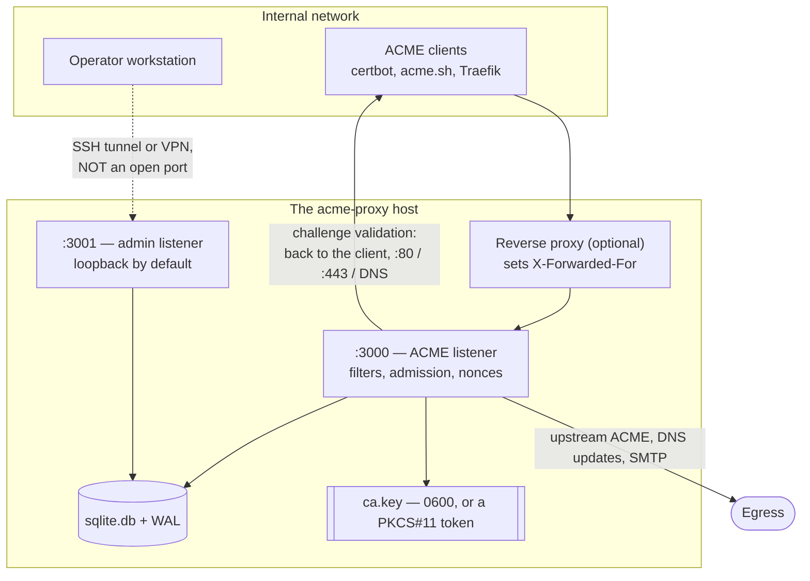

# Deployment

A deployment makes two choices: where the process runs, and how many processes
there are.

- **Where.** Directly on a Linux VM under [systemd](systemd.md), or in a
  [container](containers.md) from the published image. Both run the same binary
  and read the same configuration.
- **How many.** One process doing everything is the default and suits most
  deployments. [Separate role processes](roles.md) put the ACME listener, the
  web admin and the job worker in processes of their own, so only the worker
  holds the CA key. [Docker Compose, Roles Split](compose_roles.md) is a
  complete recipe for that shape, on PostgreSQL.

Whatever the shape, the rest of this page applies: which socket goes where, how
to sit behind a reverse proxy, and how to reach the web admin. Moving to a new
release is in [Upgrading](upgrading.md).

## Where each socket belongs

`acme-proxy` opens **two** listeners when the web admin is enabled, and they
belong on different sides of your boundary. The ACME listener answers
unauthenticated clients by design; the admin listener has no filter chain and no
admission control, and its only access controls are the bind address, TLS and
the session.


```mermaid
graph TD
    subgraph internal["Internal network"]
        CLIENTS["ACME clients<br/>certbot, acme.sh, Traefik"]
        OPS["Operator workstation"]
    end

    subgraph host["The acme-proxy host"]
        RP["Reverse proxy (optional)<br/>sets X-Forwarded-For"]
        ACME[":3000 — ACME listener<br/>filters, admission, nonces"]
        ADMIN[":3001 — admin listener<br/>loopback by default"]
        DB[("sqlite.db + WAL")]
        CAKEY[["ca.key — 0600, or a PKCS#11 token"]]
    end

    CLIENTS --> RP --> ACME
    OPS -.->|"SSH tunnel or VPN,<br/>NOT an open port"| ADMIN
    ACME --> DB
    ADMIN --> DB
    ACME --> CAKEY

    ACME -->|"challenge validation:<br/>back to the client, :80 / :443 / DNS"| CLIENTS
    ACME -->|"upstream ACME, DNS updates, SMTP"| OUT(["Egress"])
```

Two edges are the ones people get wrong:

- **The dotted one.** If the admin listener is reachable from anywhere but
  loopback, startup refuses unless `admin.tls.enabled` is on — and even then, a
  tunnel is the better answer. See below.
- **The validation edge points back at the client.** With `challenge.bypass =
  false`, the server opens connections *to* the machines asking for
  certificates. A firewall that only permits inbound traffic leaves orders
  sitting at `pending`.

## Reverse proxy (optional)

`acme-proxy` acts as an HTTP server, typically binding to port `3000`. You can
bind it directly to `80` (requires `CAP_NET_BIND_SERVICE`) or place it behind a
reverse proxy like Nginx or Traefik, which can provide TLS termination for the
ACME API itself.

Two things to get right when proxying:

- Set `server.base_url` to the **public** URL. It is what the directory
  advertises and what every signed request is checked against (RFC 8555 §6.4),
  so a mismatch rejects every client. It is never derived from the request.
- If you want IP-based filters to see the real client rather than the proxy, set
  `filter.trusted_proxies` to the proxy's addresses and, if it is not
  `x-forwarded-for`, `filter.forwarded_header`. Note these are **`[filter]`**
  keys, not `[server]` keys.

Alternatively, skip the reverse proxy and let `acme-proxy` terminate TLS itself
— see [TLS Termination](../features/tls_termination.md).

---

## Exposing the web admin (or rather, not)

The [Web Admin](../operations/webadmin.md) is a **second listener** and is off
by default. When you turn it on, it binds `127.0.0.1:3001` and stays there
unless you say otherwise.

**The recommended way to reach it is an SSH tunnel**, which needs no
configuration change and no second certificate:

```console
$ ssh -N -L 3001:127.0.0.1:3001 ca.example.com
```

Then open `http://localhost:3001`. `admin.base_url` stays at its default,
because from the browser's point of view the panel really is on localhost.

If you must bind it to a real interface, **TLS is mandatory** — startup refuses
a non-loopback bind while `admin.tls.enabled` is `false`, because the session
cookie is sent `Secure` and a browser silently declines to store one over plain
HTTP anywhere but `localhost`:

```toml
[admin]
enabled      = true
bind_address = "0.0.0.0:3001"
base_url     = "https://admin.example.com:3001"

[admin.tls]
enabled = true
```

Two things this listener does **not** have, deliberately: admission control and
a filter chain. Access control here is the bind address, TLS, and the session.
Note also that it does **not** honour `X-Forwarded-For` — behind a reverse proxy
the sign-in rate limiter counts the proxy, which is one more reason to prefer
the tunnel.

Under systemd, nothing extra is needed: the panel shares the process, the unit
and the database. Bootstrap the first operator once, before or after enabling
it:

```console
$ printf '%s' "$PASSWORD" | acme-proxy admin user create alice
```

In a container, a loopback bind is loopback *inside* the container, which no
published port reaches. There the listener binds a real interface, so TLS is on,
and the port is published on the host's loopback alone so that the tunnel is
still the way in — [Docker Compose, Roles
Split](compose_roles.md#reaching-the-web-admin) shows the arrangement.
