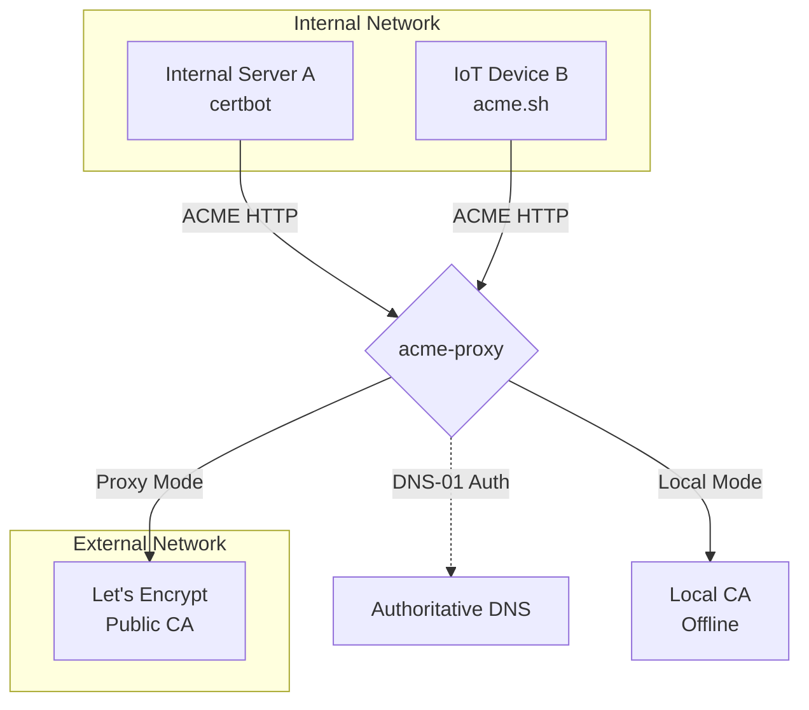

# Introduction

Welcome to the **`acme-proxy`** documentation.

`acme-proxy` is a high-performance, asynchronous Rust server designed to act as an advanced ACME (Automated Certificate Management Environment) router, relay, and local CA. It fully implements RFC 8555 alongside modern extensions like Account Key Rollover (RFC 8555 §7.3.5) and ACME Renewal Information (RFC 9773).

## The Problem

In enterprise environments, internal servers and IoT devices often need valid TLS certificates. However:
1. Public CAs (like Let's Encrypt) require DNS or HTTP validation, which internal servers hidden behind firewalls cannot easily satisfy.
2. Handing out the company's global DNS API credentials to every internal server to perform DNS-01 challenges is a massive security risk.
3. Legacy internal PKI systems often do not speak the ACME protocol, forcing operators to write custom bash scripts to rotate certificates.
4. When using external or commercial CAs, organizations are sometimes restricted to a single account or a limited number of External Account Binding (EAB) credentials validated for specific domains. Distributing these scarce upstream credentials directly to hundreds of internal servers is both impractical and risky.

## The Solution

`acme-proxy` solves this by standing between your internal clients and the actual Certificate Authority. By registering a single account with the upstream CA, it acts as an **account multiplexer**—allowing you to issue unlimited local EAB credentials to your internal teams without exhausting your upstream limits.

- **As a Proxy**: It intercepts ACME requests from internal clients, opens a corresponding order with Let's Encrypt, and safely solves the external DNS-01 challenges on the client's behalf using a single, centrally secured DNS TSIG key.
- **As a Filter**: It inspects the client's IP and requested DNS names against strict policies (like NetBox IPAM) before allowing the request to proceed.
- **As a Local CA**: It can operate entirely offline, minting self-signed certificates with a robust embedded ECDSA CA for dev and testing environments.
- **As a Multi-Tenant Server**: Through its Profile system, a single binary can host a Local CA on `/profile/dev` and a strictly-filtered Let's Encrypt relay on `/profile/prod`.
- **As a Record**: Every issuance *and every refusal* is written to an append-only [audit trail](operations/audit.md), naming the actor, the address it came from and the names it asked for — the question "who got this certificate, and from where" has an answer.

Built on `axum`, `tokio`, and `sqlx` (SQLite in WAL mode), `acme-proxy` is designed for safety, high concurrency, and minimal operational overhead.
