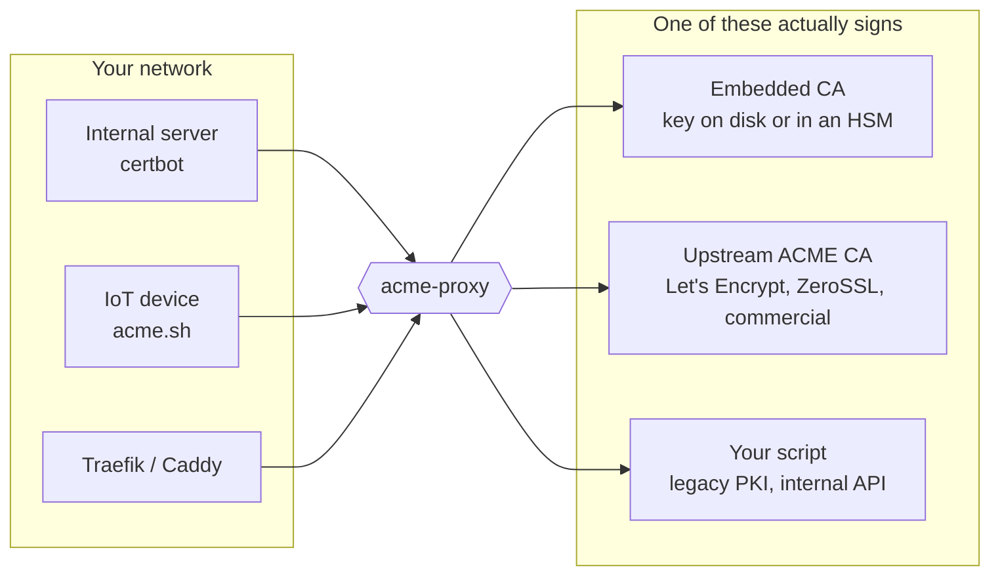

# Introduction

`acme-proxy` is an ACME server: the thing certbot, acme.sh, lego, Traefik and
Caddy talk to when they ask for a certificate. It implements RFC 8555 in full,
plus account key rollover (§7.3.5) and Renewal Information (RFC 9773).

What it does *behind* that interface is the point. Clients prove control of
their names to `acme-proxy`, under whatever policy you configure, and it decides
how the certificate is actually produced — signing locally, relaying to a public
CA, or handing the request to a script.

## The problem

Internal servers and IoT devices need TLS certificates, and cannot easily get
them:
1. Public CAs (like Let's Encrypt) require DNS or HTTP validation, which
   internal servers hidden behind firewalls cannot easily satisfy.
2. Handing out the company's global DNS API credentials to every internal server
   to perform DNS-01 challenges is a massive security risk.
3. Legacy internal PKI systems often do not speak the ACME protocol, forcing
   operators to write custom bash scripts to rotate certificates.
4. When using external or commercial CAs, organizations are sometimes restricted
   to a single account or a limited number of External Account Binding (EAB)
   credentials validated for specific domains. Distributing these scarce
   upstream credentials directly to hundreds of internal servers is both
   impractical and risky.

## The solution

`acme-proxy` solves this by standing between your internal clients and the
actual Certificate Authority. By registering a single account with the upstream
CA, it acts as an **account multiplexer**—allowing you to issue unlimited local
EAB credentials to your internal teams without exhausting your upstream limits.

Clients speak ordinary ACME to `acme-proxy` and prove control of their names to
*it*. Which of the three backends produces the certificate is a configuration
choice they never see — and it can differ per endpoint, so one process can serve
a local CA at `/profile/dev` and a Let's Encrypt relay at `/profile/prod`.

- **As a Proxy**: It intercepts ACME requests from internal clients, opens a
  corresponding order with Let's Encrypt, and safely solves the external DNS-01
  challenges on the client's behalf using a single, centrally secured DNS TSIG
  key.
- **As a Filter**: It inspects the client's IP and requested DNS names against
  strict policies — including asking your [IPAM](ipam/index.md) (NetBox or
  phpIPAM) whether that address owns those names — before allowing the request
  to proceed.
- **As a Local CA**: It can operate entirely offline, issuing from an embedded
  ECDSA CA whose key is a file on disk or a PKCS#11 token.
- **As a Multi-Tenant Server**: Through its Profile system, a single binary can
  host a Local CA on `/profile/dev` and a strictly-filtered Let's Encrypt relay
  on `/profile/prod`.
- **As a Record**: Every issuance *and every refusal* is written to an
  append-only [audit trail](operations/audit.md), naming the actor, the address
  it came from and the names it asked for — the question "who got this
  certificate, and from where" has an answer.

It is built on `axum`, `tokio` and `sqlx`, and stores everything in one SQLite
file in WAL mode. There is no second datastore, no message queue and no
scheduler to operate.

It is published on [crates.io](https://crates.io/crates/acme-proxy), so
`cargo install acme-proxy` gets you the whole thing — server and admin CLI in
one binary. See [Installation](getting_started/installation.md).
