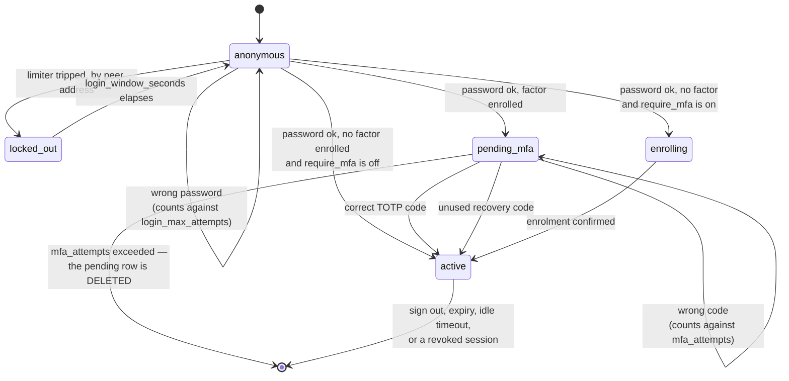

# Web Admin — Users & Sessions

The web admin has no sign-up page. Operators are created from a shell on the
host, with `acme-proxy admin`.

## Bootstrapping the first operator

```console
$ printf '%s' "$PASSWORD" | acme-proxy admin user create alice
Created admin user alice (bac6a47e-711b-4e8e-858e-417da905dab9).
```

That is enough to sign in — the panel itself does not need to be running, and
does not need to be enabled yet.

If the panel is enabled with no operators, startup says so:

```text
WARN event="admin_no_users" the web admin is enabled but has no operators:
     create one with `acme-proxy admin user create <username>`
```

## The password never goes in argv

There is deliberately **no `--password` flag**, and `clap` refuses one:

```console
$ acme-proxy admin user create alice --password hunter2
error: unexpected argument '--password' found
```

argv is visible to every process on the host via `ps`, and shells routinely
write it to history. The same reasoning already applies to the upstream EAB
secret (`acme-proxy upstream register`).

Two ways in, both of which keep it out of the process table:

```console
$ printf '%s' "$PASSWORD" | acme-proxy admin user create alice   # stdin
$ acme-proxy admin user create alice --password-file /run/secrets/pw
```

`--password-file` strips a single trailing newline, so it does not matter
whether the file was written with `printf '%s'` or `printf '%s\n'`.

Typing it interactively works too, but the password **will echo** — there is no
`rpassword` here, because echo suppression needs a real TTY and that would break
the injectable-reader design the whole admin layer is testable through. The
command warns when it notices a terminal.

## Password policy

Three rules, checked in this order, each of which ends the check — one refusal
names one reason:

1. **Length.** Minimum 12 characters, maximum 1024 bytes.
2. **It must not name this deployment** — see the word list below.
3. **It must not be a commonly used password** — see the corpus below.

There are deliberately **no composition rules**. "One digit, one symbol"
measurably pushes people towards weaker, more guessable passwords; the two
checks above refuse the passwords composition rules were reaching for, without
dictating shape.

Length is counted in **characters**, so a 12-character passphrase in a non-Latin
script is 12, not its byte count. The maximum is in bytes, and is a
denial-of-service control rather than a security one: without it a sign-in could
hand 600 000 iterations a multi-megabyte input.

All three run on `admin user create` and `admin user passwd`, and **none of them
runs on sign-in**. A password that predates a rule change must still work, and a
corpus refresh must never lock an operator out of the panel they would need to
be signed in to fix.

### The context-specific word list

A password may not **contain** any word that names this deployment, compared
case-insensitively. Words shorter than four characters are ignored: a subject
holding `CA`, or a host label `io`, would refuse a large share of every password
anyone typed and buy nothing.

The list is derived from your own configuration, not fixed:

| Source | What is taken |
|---|---|
| Always | `acme`, `proxy` |
| The operator's username | Split on anything that is not a letter or a digit |
| `server.base_url`, `admin.base_url` | The **host** only, split on `.` and `-` |
| `[signer.local_ca.subject]` — global and each profile's own | `common_name`, `organization`, `organizational_unit`, `state`, `locality`, each split into words |
| Each `[profiles.<name>]` name | The name, which appears in every `kid` and order URL that endpoint issues |

So a CA at `https://ca.example.com` with a CommonName of "Example Corp Issuing
CA", managed by `operator`, refuses any password containing `acme`, `proxy`,
`example`, `corp`, `issuing` or `operator` — `acmeproxy2026!` among them.

Two limits are deliberate:

- **A CA already on disk is not described here.** `[signer.local_ca.subject]` is
  read only when this server *generates* a CA, so an adopted `ca.pem` carries a
  subject the configuration never saw. Add those words to the subject section if
  you want them barred.
- **`country` is not read**, being two characters and so below the floor
  whatever it holds.

If no profile resolves — which is every `admin user create` run against a
configuration that has none yet — the rest of the list still applies. A missing
section is never a reason to refuse a password change.

### The common-password corpus

A password may not **be** (whole-string, case-insensitively) one of 13 918 known
common passwords compiled into the binary. It is not a substring test:
`a-long-enough-password` contains `password` and is accepted.

The corpus is the top 700 000 entries of SecLists'
`xato-net-10-million-passwords-1000000.txt`, **filtered to entries of at least
12 characters**. That filter is the whole reason a compiled-in list is
affordable: `password`, `qwerty` and `123456` are refused by the length rule
before this check is reached, so carrying them would cost every deployment
bytes — including the ones running with `admin.enabled = false` — in exchange
for nothing. Filtering turns 8.5 MB into 195 KB.

Provenance, the exact rank cut, the size budget it was derived from and the
refresh command live in `src/admin/corpus/README.md`.

Passwords are stored as PBKDF2-HMAC-SHA256 at 600 000 iterations (OWASP's
current recommendation for the non-Argon2 case), in a self-describing format:

```text
pbkdf2-sha256$600000$<salt-b64url>$<hash-b64url>
```

Self-describing so the cost can be raised, or the algorithm swapped, without a
migration: a row written under older parameters is re-hashed in place on its
owner's next successful sign-in. **A lost password is replaced, never
recovered** — nothing can read one back.

## Second factor (TOTP)

Off by default and per-operator. Once enrolled, signing in is two requests: the
password mints a **half-authenticated** session that reaches nothing but the
page finishing the login, and a code from an authenticator app turns it into a
real one.



Three things the diagram is making explicit:

- **Promotion mints a new session.** `pending_mfa → active` is an insert plus a
  delete, not an `UPDATE` — a new cookie *and* a new CSRF token — because the
  pending token crossed the wire before authentication had finished.
- **Guessing is bounded twice**, and the two bounds are not redundant. The
  limiter is keyed on the peer address; `mfa_attempts` is keyed on the session,
  because a `pending_mfa` cookie is deliberately valid from any address and one
  IPv6 /64 supplies 2⁶⁴ fresh addresses.
- **`enrolling` is only reachable with no factor.** A session that owes a *code*
  can never reach an enrolment route, or the factor would be bypassable by
  enrolling a new one over it.

### Enrolling

From the panel, not from a shell. Sign in, click your username in the top-right
corner, and press **Set one up**:

1. The page shows a base32 setup key and an `otpauth://` URI. Type the key into
   an authenticator app, or open the URI on the device holding it.
2. Type the code the app shows and press **Confirm**. Nothing is enabled until
   you do — an enrolment begun and abandoned leaves you exactly where you were.
3. Ten **recovery codes** appear. Store them now; they are shown once.

There is no QR code, and the panel's `Content-Security-Policy` is not why — it
already permits a `data:` image. A QR renderer would be a dependency for a
convenience rather than a capability, and every authenticator has "enter a setup
key manually".

There is deliberately **no `acme-proxy admin user totp enrol`**. There is no way
to enrol from a terminal that does not put the setup key into scrollback and the
shell's own history — the same reasoning that keeps a password out of `argv`.

The codes are HMAC-**SHA-1**, six digits, thirty seconds, which is RFC 6238's
default. Not a lapse: Google Authenticator ignores the `algorithm=` parameter of
an `otpauth://` URI and always computes SHA-1, so anything else would produce an
entry that yields wrong codes forever with no diagnosis from either side.
SHA-1's collision attacks do not weaken HMAC-SHA1.

### Recovery codes

Ten, each usable once, hashed the same one-way as a password — so a lost set is
**replaced, never recovered**:

```console
$ acme-proxy admin user totp recovery-codes alice
New recovery codes for alice — the previous set no longer works.
Store these now; they are not recoverable.

  K7QF2-3BXTM
  …
```

Type one into the code box at sign-in exactly as you would a six-digit code: the
server tells them apart by shape, so there is no mode to choose. Case and the
`-` do not matter.

### When somebody is locked out

A lost phone with no recovery codes left is a shell command on the host — the
same place the first operator was created:

```console
$ acme-proxy admin user totp status alice
alice                 totp=enabled  recovery-codes=3

$ acme-proxy admin user totp reset alice
Remove the second factor and every recovery code for alice, and revoke their
sessions? [y/N] y
Removed the second factor for alice. Their sessions were revoked; they can sign
in with a password alone until they enrol again.
```

`reset` asks first, unlike most admin commands, because it *removes* a security
control rather than tightening one. It takes the recovery codes and every live
session with it.

`status` distinguishes three states, and the middle one matters: `pending` means
an enrolment was started and never confirmed, which behaves exactly like `off`
at the sign-in prompt. An operator who believes they enrolled has no other way
to find out they did not.

### Requiring it of everybody

```toml
[admin]
require_mfa = true
```

This governs the operator who has **no** factor: their next sign-in lands on the
enrolment page and their session stays half-authenticated until they finish. An
operator who already has one is challenged whether this is set or not.

It deliberately does **not** refuse a password-only sign-in. Enrolling needs a
session and a session would then need a factor, so refusing would brick the
panel — including the way in to fix it.

Two consequences worth knowing:

- It does not retroactively end sessions that predate it. The lever that does is
  `acme-proxy admin session revoke --all`.
- Turning the factor *off* is refused while it is set, since the operator would
  simply be made to enrol again on their next sign-in.

While it is on and somebody still has no factor, every start says so:

```text
WARN event="admin_mfa_enrolment_pending" count=2
     admin.require_mfa is on and some operators have no second factor
```

### What it costs an attacker

A half-authenticated session lives **five minutes** and no longer — it is a
password that has been accepted and nothing more. Code attempts share the login
rate limiter (`admin.login_max_attempts` per `admin.login_window_seconds`, per
address), so five wrong codes also lock the password out from that address: one
address, one budget. A code accepted once cannot be replayed inside its own
thirty-second window.

The password asked for again when an operator replaces or removes a live
factor shares that same budget, and is checked before the hash rather than
after it. So a stolen session cookie cannot be used to grind the account
password — which matters, because a correct guess there would let the thief
enrol their own authenticator, end every other session and void the recovery
codes. Past the budget those routes answer `429` with `Retry-After`, and the
account card shows it as a banner. What the budget does not bound is an
attacker with many source addresses: the cookie is deliberately valid from
anywhere, so each address buys its own `admin.login_max_attempts`. Rotate the
password and run `acme-proxy admin session revoke --all` if you believe a
cookie has been taken.

## Changing your own password

Also from the panel, not only from the host. Sign in, open your username in the
top-right corner, and use the **Password** card: current password, then the
new one.

The current password is asked for unconditionally — unlike the second-factor
controls above, this runs whether or not you have TOTP enrolled. ASVS 5.0
V6.2.3 is why: a live cookie is not proof you still know the password, only
that you did at sign-in. Guessing it is bounded the same way and shares the
same budget as [What it costs an attacker](#what-it-costs-an-attacker) — five
wrong attempts lock the address out. The new one still has to satisfy
[Password policy](#password-policy).

```console
$ acme-proxy admin user passwd alice --password-file /run/secrets/new
Password changed for alice. Every session they held was revoked.
```

That command, run from the host, still ends **every** session — there was no
request to preserve. The panel's own change is different in exactly one way:
the session that submitted it stays signed in, and every *other* session of
that operator is revoked. Rotating a credential from inside a session you are
already trusted on need not sign you out of the tab that did it.

## Managing operators

```console
$ acme-proxy admin user list
alice                 active    totp=on   2026-08-08T13:21:18Z  2026-08-08T15:07:17Z
1 of 1 row(s).

$ acme-proxy admin user list --json

$ acme-proxy admin user show alice
id             bac6a47e-711b-4e8e-858e-417da905dab9
username       alice
status         active
totp           enabled
recovery_codes 7
created        2026-08-08T13:21:18Z
updated        2026-08-08T15:07:17Z
last_login     2026-08-08T15:07:17Z

$ acme-proxy admin user passwd alice --password-file /run/secrets/new
Password changed for alice. Every session they held was revoked.

$ acme-proxy admin user disable alice
Disabled alice. Their sessions were revoked.

$ acme-proxy admin user enable alice

$ acme-proxy admin user delete alice          # asks first; -y skips
```

`admin user list` is paged like every other listing
([Admin CLI → Paging](cli.md#paging)) and is the one that is **oldest first**:
the bootstrap operator is the row whose position should not move as colleagues
are added. `admin user show` adds the two things a row cannot carry — whether
enrolment was started and never confirmed, and how many recovery codes are
left. The first matters because "pending" and "no factor" behave identically at
the login prompt.

Usernames are stored lowercased, so `Alice` and `alice` cannot become two logins
that read as one in a log line.

**A password change revokes every session that user held.** A password changed
because it may have leaked, that left the leaked session alive, would be a
change in name only. Disabling does the same.

### From the panel

Also from the **Operators** page, not only from the host — for the operations
that do not mint a credential. Sign in, open **Operators**, and pick a
colleague:

```text
bob                   active    off    2026-08-08T13:21:18Z  2026-08-08T15:07:17Z
```

Their page shows the same status and second-factor summary `admin user show`
does, plus their own live sessions (see [Sessions](#sessions) below), and three
buttons: **Disable**, **Reset second factor**, and, per session, **Revoke**.
Every one of them asks for *your own* password again first — the same
`check_step_up` gate a live second-factor change already runs through, since
disabling a colleague's account or ending one of their sessions is a much
larger blast radius than anything on your own account page, and a stolen
cookie alone should not be sufficient authority for it.

```console
$ curl -X POST https://admin.example.com/api/operators/bob/disable \
    -H 'Cookie: __Host-acme_admin_session=…' -H 'X-CSRF-Token: …' \
    -d '{"password": "…"}'
```

Two things this surface deliberately does **not** do, both already settled
above: **`create` and `passwd` stay on the host.** Minting a credential is
where "no sign-up page" already draws the line, and everything the Operators
page offers only ever *tightens* an existing account — it can disable one,
reset its factor, or end a session, never set a password or bring one into
being. And **an operator can never target themself here** — `GET
/ui/operators/{your own username}` redirects straight to
[Your account](#changing-your-own-password), which already owns every one of
those actions for yourself, so there is exactly one page an operator manages
their own account from.

## Sessions

```console
$ acme-proxy admin session list
01234567  bac6a47e-…  active  2026-08-08T15:07:17Z  expires=2026-08-09T03:07:17Z  192.0.2.1
1 of 1 row(s).

$ acme-proxy admin session list --username alice --json

$ acme-proxy admin session revoke --user alice
Revoked 2 session(s) for alice.

$ acme-proxy admin session revoke --all
```

The `id` shown is a fingerprint of the stored token hash, not the hash itself —
printing the hash would put every live session's lookup key on a terminal.

Two deadlines apply, and whichever comes first wins:

| Key | Default | |
|---|---|---|
| `admin.session_ttl_seconds` | `43200` (12 h) | absolute; never extended |
| `admin.session_idle_timeout_seconds` | `3600` (1 h) | advanced on use |

The idle deadline is advanced at most once a minute, so a page polling every few
seconds is not a stream of database writes.

An `admin_session_sweep` job removes expired and idle rows for the life of the
process, starting with one pass at startup. Unlike nonces, sessions outlive a
restart, so a startup-only sweep would leak every session an operator never
explicitly signed out of.

`created_ip` and `user_agent` are recorded for forensics and are **never**
compared against the live request: pinning a session to an address breaks every
mobile and CGNAT operator, and pinning it to a User-Agent breaks on the next
browser update.

### From the panel

The CLI's `revoke` only ever takes a whole operator (`--user`) or the whole
server (`--all`) — before this there was no single-session form at all, on
either front end. The panel now has one, at two different trust levels:

**Your own sessions.** Sign in, open your username in the top-right corner,
and scroll to **Sessions**: every browser currently signed in as you, the one
answering this request labelled, and a **Revoke** beside each of the others.
No password re-entry — this is the same trust level as **Sign out
everywhere**, which sits right below it and is now a button rather than only
an API route nothing linked to.

```console
$ curl https://admin.example.com/api/account/sessions \
    -H 'Cookie: __Host-acme_admin_session=…'
```

Revoking the session making the request behaves exactly like signing out of
just this browser: the cookie is cleared and you land back on the sign-in
page. Revoking another one of your own ends it immediately, wherever it is
signed in.

**Another operator's sessions.** Reached from their page under
[Operators](#managing-operators) — the "colleague's laptop went missing"
answer that used to require SSH. Listing and revoking there behaves the same
way, with one difference: it asks for your own password first, the same gate
described [above](#managing-operators). A session id is a fingerprint of the
stored token hash either way — printing the hash would put every live
session's lookup key on a terminal — and it only ever resolves within the one
operator it was listed under, so an id copied from one operator's page can
never revoke another's session by accident or by guessing.

## What the log says

A failed sign-in returns one `invalid_credentials` whatever went wrong, so the
endpoint cannot be used to enumerate operators. The log keeps the distinction:

```text
WARN event="admin_login_failed" username="alice" client_ip=… reason="wrong_password"
WARN event="admin_login_failed" username="ghost" client_ip=… reason="unknown_user"
WARN event="admin_login_failed" username="bob"   client_ip=… reason="account_disabled"
WARN event="admin_login_failed" username="alice" client_ip=… reason="rate_limited"
INFO event="admin_login_succeeded" username="alice" client_ip=…
```

The second step keeps the same shape — one refusal to the client, the reason in
the log — and note that `admin_login_succeeded` is emitted at *promotion*, not
when the password is accepted:

```text
INFO event="admin_login_mfa_pending" username="alice" client_ip=… step="verify"
WARN event="admin_mfa_failed" username="alice" client_ip=… reason="wrong_code"
WARN event="admin_mfa_failed" username="alice" client_ip=… reason="replayed"
INFO event="admin_mfa_verified" username="alice" method="totp"
WARN event="admin_mfa_recovery_code_used" username="alice" remaining=6
INFO event="admin_mfa_enabled"  username="alice" recovery_codes=10
INFO event="admin_mfa_disabled" username="alice"
```

`reason="replayed"` is the one to look at twice: it means a *correct* code
arrived a second time inside its own window, which is what somebody replaying an
observed code looks like.

One more worth knowing, because nobody will guess it from a `401`:

```text
WARN event="admin_password_hash_unreadable" username="alice"
     stored password hash could not be decoded; run
     `acme-proxy admin user passwd` to rewrite it
```

A corrupt `admin_users` row refuses the sign-in rather than erroring the
endpoint, and the account stays unusable until the password is rewritten.

Revoking a single session, and every mutation on the Operators page, each
leave their own line — `surface` says which front end it came through and
`target_username` is absent on the self-service one, since there is nothing to
distinguish it from:

```text
INFO event="admin_session_revoked"         surface="ui"  username="alice"
INFO event="admin_operator_disabled"       surface="api" username="alice" target_username="bob"
INFO event="admin_operator_enabled"        surface="ui"  username="alice" target_username="bob"
INFO event="admin_operator_totp_reset"     surface="api" username="alice" target_username="bob"
INFO event="admin_operator_session_revoked" surface="ui" username="alice" target_username="bob"
```
