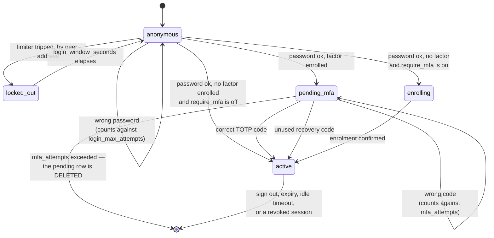

# Web Admin — Users & Sessions

The web admin has no sign-up page. Operators are created from a shell on the
host, with `acme-proxy admin`.

## Bootstrapping the first operator

```console
$ printf '%s' "$PASSWORD" | acme-proxy admin user create alice
Created admin user alice (bac6a47e-711b-4e8e-858e-417da905dab9).
```

That is enough to sign in — the panel itself does not need to be running, and
does not need to be enabled yet.

If the panel is enabled with no operators, startup says so:

```text
WARN event="admin_no_users" the web admin is enabled but has no operators:
     create one with `acme-proxy admin user create <username>`
```

## The password never goes in argv

There is deliberately **no `--password` flag**, and `clap` refuses one:

```console
$ acme-proxy admin user create alice --password hunter2
error: unexpected argument '--password' found
```

argv is visible to every process on the host via `ps`, and shells routinely
write it to history. The same reasoning already applies to the upstream EAB
secret (`acme-proxy upstream register`).

Two ways in, both of which keep it out of the process table:

```console
$ printf '%s' "$PASSWORD" | acme-proxy admin user create alice   # stdin
$ acme-proxy admin user create alice --password-file /run/secrets/pw
```

`--password-file` strips a single trailing newline, so it does not matter
whether the file was written with `printf '%s'` or `printf '%s\n'`.

Typing it interactively works too, but the password **will echo** — there is no
`rpassword` here, because echo suppression needs a real TTY and that would break
the injectable-reader design the whole admin layer is testable through. The
command warns when it notices a terminal.

## Password policy

Minimum 12 characters, maximum 1024 bytes. Length is the only rule: composition
rules ("one digit, one symbol") measurably push people towards weaker, more
guessable passwords, and this is an operator surface with a handful of accounts
rather than a consumer signup.

Length is counted in **characters**, so a 12-character passphrase in a non-Latin
script is 12, not its byte count.

Passwords are stored as PBKDF2-HMAC-SHA256 at 600 000 iterations (OWASP's
current recommendation for the non-Argon2 case), in a self-describing format:

```text
pbkdf2-sha256$600000$<salt-b64url>$<hash-b64url>
```

Self-describing so the cost can be raised, or the algorithm swapped, without a
migration: a row written under older parameters is re-hashed in place on its
owner's next successful sign-in. **A lost password is replaced, never
recovered** — nothing can read one back.

## Second factor (TOTP)

Off by default and per-operator. Once enrolled, signing in is two requests: the
password mints a **half-authenticated** session that reaches nothing but the
page finishing the login, and a code from an authenticator app turns it into a
real one.



Three things the diagram is making explicit:

- **Promotion mints a new session.** `pending_mfa → active` is an insert plus a
  delete, not an `UPDATE` — a new cookie *and* a new CSRF token — because the
  pending token crossed the wire before authentication had finished.
- **Guessing is bounded twice**, and the two bounds are not redundant. The
  limiter is keyed on the peer address; `mfa_attempts` is keyed on the session,
  because a `pending_mfa` cookie is deliberately valid from any address and one
  IPv6 /64 supplies 2⁶⁴ fresh addresses.
- **`enrolling` is only reachable with no factor.** A session that owes a *code*
  can never reach an enrolment route, or the factor would be bypassable by
  enrolling a new one over it.

### Enrolling

From the panel, not from a shell. Sign in, click your username in the top-right
corner, and press **Set one up**:

1. The page shows a base32 setup key and an `otpauth://` URI. Type the key into
   an authenticator app, or open the URI on the device holding it.
2. Type the code the app shows and press **Confirm**. Nothing is enabled until
   you do — an enrolment begun and abandoned leaves you exactly where you were.
3. Ten **recovery codes** appear. Store them now; they are shown once.

There is no QR code, and the panel's `Content-Security-Policy` is not why — it
already permits a `data:` image. A QR renderer would be a dependency for a
convenience rather than a capability, and every authenticator has "enter a setup
key manually".

There is deliberately **no `acme-proxy admin user totp enrol`**. There is no way
to enrol from a terminal that does not put the setup key into scrollback and the
shell's own history — the same reasoning that keeps a password out of `argv`.

The codes are HMAC-**SHA-1**, six digits, thirty seconds, which is RFC 6238's
default. Not a lapse: Google Authenticator ignores the `algorithm=` parameter of
an `otpauth://` URI and always computes SHA-1, so anything else would produce an
entry that yields wrong codes forever with no diagnosis from either side.
SHA-1's collision attacks do not weaken HMAC-SHA1.

### Recovery codes

Ten, each usable once, hashed the same one-way as a password — so a lost set is
**replaced, never recovered**:

```console
$ acme-proxy admin user totp recovery-codes alice
New recovery codes for alice — the previous set no longer works.
Store these now; they are not recoverable.

  K7QF2-3BXTM
  …
```

Type one into the code box at sign-in exactly as you would a six-digit code: the
server tells them apart by shape, so there is no mode to choose. Case and the
`-` do not matter.

### When somebody is locked out

A lost phone with no recovery codes left is a shell command on the host — the
same place the first operator was created:

```console
$ acme-proxy admin user totp status alice
alice                 totp=enabled  recovery-codes=3

$ acme-proxy admin user totp reset alice
Remove the second factor and every recovery code for alice, and revoke their
sessions? [y/N] y
Removed the second factor for alice. Their sessions were revoked; they can sign
in with a password alone until they enrol again.
```

`reset` asks first, unlike most admin commands, because it *removes* a security
control rather than tightening one. It takes the recovery codes and every live
session with it.

`status` distinguishes three states, and the middle one matters: `pending` means
an enrolment was started and never confirmed, which behaves exactly like `off`
at the sign-in prompt. An operator who believes they enrolled has no other way
to find out they did not.

### Requiring it of everybody

```toml
[admin]
require_mfa = true
```

This governs the operator who has **no** factor: their next sign-in lands on the
enrolment page and their session stays half-authenticated until they finish. An
operator who already has one is challenged whether this is set or not.

It deliberately does **not** refuse a password-only sign-in. Enrolling needs a
session and a session would then need a factor, so refusing would brick the
panel — including the way in to fix it.

Two consequences worth knowing:

- It does not retroactively end sessions that predate it. The lever that does is
  `acme-proxy admin session revoke --all`.
- Turning the factor *off* is refused while it is set, since the operator would
  simply be made to enrol again on their next sign-in.

While it is on and somebody still has no factor, every start says so:

```text
WARN event="admin_mfa_enrolment_pending" count=2
     admin.require_mfa is on and some operators have no second factor
```

### What it costs an attacker

A half-authenticated session lives **five minutes** and no longer — it is a
password that has been accepted and nothing more. Code attempts share the login
rate limiter (`admin.login_max_attempts` per `admin.login_window_seconds`, per
address), so five wrong codes also lock the password out from that address: one
address, one budget. A code accepted once cannot be replayed inside its own
thirty-second window.

## Managing operators

```console
$ acme-proxy admin user list
alice                 active    totp=on   2026-08-08T13:21:18Z  2026-08-08T15:07:17Z

$ acme-proxy admin user list --json

$ acme-proxy admin user passwd alice --password-file /run/secrets/new
Password changed for alice. Every session they held was revoked.

$ acme-proxy admin user disable alice
Disabled alice. Their sessions were revoked.

$ acme-proxy admin user enable alice

$ acme-proxy admin user delete alice          # asks first; -y skips
```

Usernames are stored lowercased, so `Alice` and `alice` cannot become two logins
that read as one in a log line.

**A password change revokes every session that user held.** A password changed
because it may have leaked, that left the leaked session alive, would be a
change in name only. Disabling does the same.

## Sessions

```console
$ acme-proxy admin session list
01234567  bac6a47e-…  active  2026-08-08T15:07:17Z  expires=2026-08-09T03:07:17Z  192.0.2.1

$ acme-proxy admin session list --username alice --json

$ acme-proxy admin session revoke --user alice
Revoked 2 session(s) for alice.

$ acme-proxy admin session revoke --all
```

The `id` shown is a fingerprint of the stored token hash, not the hash itself —
printing the hash would put every live session's lookup key on a terminal.

Two deadlines apply, and whichever comes first wins:

| Key | Default | |
|---|---|---|
| `admin.session_ttl_seconds` | `43200` (12 h) | absolute; never extended |
| `admin.session_idle_timeout_seconds` | `3600` (1 h) | advanced on use |

The idle deadline is advanced at most once a minute, so a page polling every few
seconds is not a stream of database writes.

A reaper sweeps expired and idle rows for the life of the process, and once at
startup. Unlike nonces, sessions outlive a restart, so a startup-only sweep
would leak every session an operator never explicitly signed out of.

`created_ip` and `user_agent` are recorded for forensics and are **never**
compared against the live request: pinning a session to an address breaks every
mobile and CGNAT operator, and pinning it to a User-Agent breaks on the next
browser update.

## What the log says

A failed sign-in returns one `invalid_credentials` whatever went wrong, so the
endpoint cannot be used to enumerate operators. The log keeps the distinction:

```text
WARN event="admin_login_failed" username="alice" client_ip=… reason="wrong_password"
WARN event="admin_login_failed" username="ghost" client_ip=… reason="unknown_user"
WARN event="admin_login_failed" username="bob"   client_ip=… reason="account_disabled"
WARN event="admin_login_failed" username="alice" client_ip=… reason="rate_limited"
INFO event="admin_login_succeeded" username="alice" client_ip=…
```

The second step keeps the same shape — one refusal to the client, the reason in
the log — and note that `admin_login_succeeded` is emitted at *promotion*, not
when the password is accepted:

```text
INFO event="admin_login_mfa_pending" username="alice" client_ip=… step="verify"
WARN event="admin_mfa_failed" username="alice" client_ip=… reason="wrong_code"
WARN event="admin_mfa_failed" username="alice" client_ip=… reason="replayed"
INFO event="admin_mfa_verified" username="alice" method="totp"
WARN event="admin_mfa_recovery_code_used" username="alice" remaining=6
INFO event="admin_mfa_enabled"  username="alice" recovery_codes=10
INFO event="admin_mfa_disabled" username="alice"
```

`reason="replayed"` is the one to look at twice: it means a *correct* code
arrived a second time inside its own window, which is what somebody replaying an
observed code looks like.

One more worth knowing, because nobody will guess it from a `401`:

```text
WARN event="admin_password_hash_unreadable" username="alice"
     stored password hash could not be decoded; run
     `acme-proxy admin user passwd` to rewrite it
```

A corrupt `admin_users` row refuses the sign-in rather than erroring the
endpoint, and the account stays unusable until the password is rewritten.
